# Spring Boot

## Spring的能力

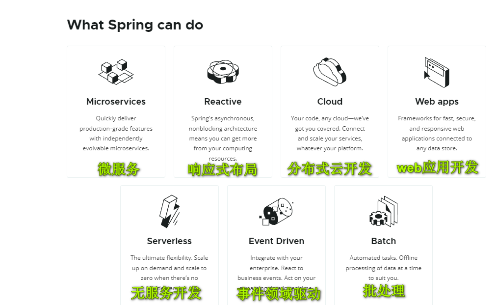


## 1.什么是SpringBoot

​	JAVAEE 应用体系中繁重的配置、低下的开发效率、高难度的三方集成，复杂的部署流程等等一直被开发人员所诟病。

​	Spring 这样的轻量级的资源整合框架，在实现其相对比较多的资源整合时，依旧需要大量的手动依赖管理，复杂的 XML 配置(还经常没有提示)。现在的软件生态应用也已经形成一定的规模，系统架构正在从单体架构，分布式架构，跨越到微服务架构。随着整个架构体系的变化，企业对技术的要求也在变化，现在的企业更注重技术的开箱即用，更注重技术在生态圈中的深度融合，更注重轻量级的运维。由此由此spring boot 诞生。

​	Spring Boot 是 Java 软件开发框架（很多人现在把它理解为一个脚手架），其设计目的是用来简化 Spring 项目的初始搭建以及开发过程。该框架使用了特定的注解方式来进行配置，从而使开发人员不再需要大量的 xml 配置。不再需要大量的手动依赖管理。Spring Boot 基于快速构建理念，通过约定大于配置，开箱即用的方式，希望能够在蓬勃发展的快速应用开发领域成为其领导者。

​	SpringBoot的核心特性如下：

- **起步依赖(Starter Dependency)**
- **自动配置(Auto Configuration)**
- **健康检查(Actator)-监控**
- **嵌入式服务(Tomcat,Jetty)等**


## 2.Spring Boot - Hello World

**1.创建spring boot工程，添加spring web依赖：**


**2.在src/main/java/com.oracle.springboot_01下创建包controller，并创建类HelloController，代码如下：**

```java
package com.oracle.springboot_01.controller;

import org.springframework.web.bind.annotation.RequestMapping;
import org.springframework.web.bind.annotation.RestController;

/*@RestController：将数据返回为json，相当于@Controller和@ResponseBody的结合*/
@RestController
public class HelloContrller {
    
    @RequestMapping("/hello")
    public String hello() {
        return "Hello World!";
    }
}
```


**3.启动spring boot主类；**

**4.访问localhost:8080/hello得到响应：**


Spring Boot支持将项目打包成jar包来简化部署，然后通过java -jar的方式运行，它的实现是就pom.xml的插件配置实现的：

```xml
<plugin>
                <groupId>org.springframework.boot</groupId>
                <artifactId>spring-boot-maven-plugin</artifactId>
                <version>2.3.7.RELEASE</version>
                <configuration>
                    <mainClass>com.oracle.springboot_01.Springboot01Application</mainClass>
                </configuration>
                <executions>
                    <execution>
                        <id>repackage</id>
                        <goals>
                            <goal>repackage</goal>
                        </goals>
                    </execution>
                </executions>
            </plugin>
```

​	Spring Boot的强大在于它能方便的更改配置，如如果在SSM的项目中要修改tomcat的端口号，需要进入到tomcat的配置文件修改后才能生效。但Spring Boot项目能通过修改配置文件的方式进行配置的修改，在src/resource下创建application.propertise文件，在此文件中进行修改即可。如将默认的端口号8080修改成8888：

```properties
server.port=8888
```


## 3.Spring Boot启动过程

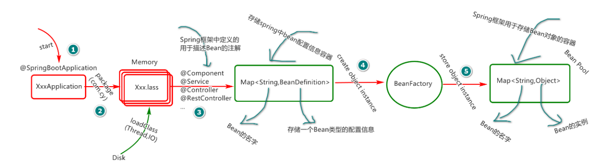

spring boot在启动时的操作：

1. 基于线程调用I/O从磁盘读取类，将其加载到内存中，此时回基于类创建字节码对象(Class类型);
2. 基于Class对象(字节码对象)读取类的配置信息(注解等)；
3. 基于类的配置进行相应的配置存储(交给Spring管理的类配置)-Map<String,BeanDifinition>；
4. 基于类的配置借助BeanFactory创建类的实例对象，多个对象存储到Map<String,Object>。


## 4.Spring Boot的依赖管理和配置原理

- **父项目做依赖管理：**在pom.xml文件中我们可以看到Spring Boot的项目依赖，它里面定义了我们开发所使用的大部分依赖及版本号，我们可以直接添加依赖使用就可以了，无需关注关注版本号，Spring Boot可以自动给我们仲裁版本：

```xml
<dependencyManagement>
        <dependencies>
            <dependency>
                <groupId>org.springframework.boot</groupId>
                <artifactId>spring-boot-dependencies</artifactId>
                <version>${spring-boot.version}</version>
                <type>pom</type>
                <scope>import</scope>
            </dependency>
        </dependencies>
</dependencyManagement>
```


- **修改版本号：**加入Spring Boot所提供的版本和我们开发时不匹配，我们也可以修改想要的版本，可以打开网站mvnrepository.com查找到需要的依赖，复制到pom.xml中就可以了：

```xml
<!-- https://mvnrepository.com/artifact/mysql/mysql-connector-java -->
<dependency>
    <groupId>mysql</groupId>
    <artifactId>mysql-connector-java</artifactId>
    <version>8.0.26</version>
</dependency>
```

当然，在更多的时候我们是将对应依赖的版本写到propertise的标签中：

```xml
<properties>
      <mysql.version>8.0.26</mysql.version>
</properties>
```

```xml
<!-- https://mvnrepository.com/artifact/mysql/mysql-connector-java -->
<dependency>
     <groupId>mysql</groupId>
     <artifactId>mysql-connector-java</artifactId>
     <version>${mysql.version}</version>
</dependency>
```

- **场景启动器：**在我们学习spring框架的时候导入了很多的依赖，复杂且麻烦。而Spring Boot给我们提供了一个starter场景启动器，只要引入了这个场景依赖，我们所需要的依赖就会被自动引入。spring-boot-starter-* ， *就某种场景，如我们想要使用web依赖，就添加如下一个就可以了：

```xml
<dependency>
      <groupId>org.springframework.boot</groupId>
      <artifactId>spring-boot-starter-web</artifactId>
</dependency>
```

​	Spring Boot为我们提供了很多场景起步依赖，详见官方文档：https://docs.spring.io/spring-boot/docs/current/reference/html/using-spring-boot.html#using-boot-starter。

​	除了Spring Boot为我们提供的依赖外，我们也可以自定义一些场景启动器，官网建议的命名不能以spring-boot-开头，这些第三方启动器建议的命名格式为：

```xml
*-spring-boot-starter
```

打开启动依赖的树状结构可以看到为我们提供了哪些依赖：

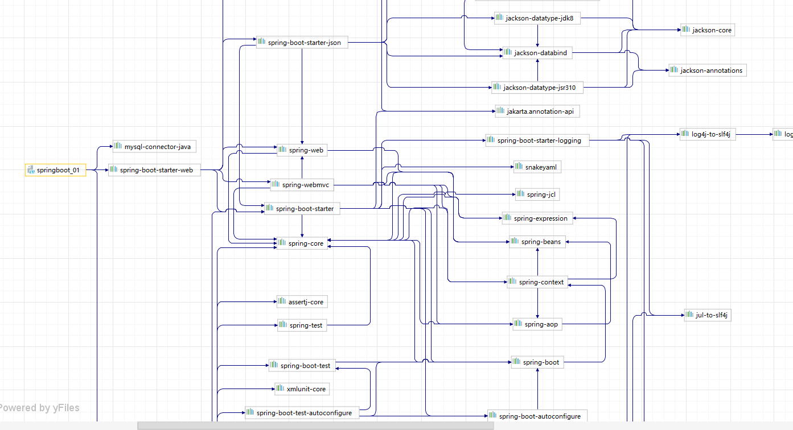


- **自动配置常用组件：**之前我们整合Spring和Spring MVC需要自己配置如DispatcherServlet等常用组件，但有了起步依赖后，它会为我们自动配置好一些常用的组件，我们可以在主启动程序中打印输出查看Spring Boot给我们配置了哪些常用组件：

```java
package com.oracle.springboot_01;

import org.springframework.boot.SpringApplication;
import org.springframework.boot.autoconfigure.SpringBootApplication;
import org.springframework.context.ConfigurableApplicationContext;

@SpringBootApplication
public class Springboot01Application {

    public static void main(String[] args) {

        ConfigurableApplicationContext run = 	SpringApplication.run(Springboot01Application.class, args);
        String[] names = run.getBeanDefinitionNames();
        for (String name : names) {
         	  System.out.println(name);
        }
    }
}

```

打印出来的组件：


- **自动包扫描：**在Spring中我们需要扫描包结构才能找到所要运行的文件，但Spring Boot的启动注解为我们提供了自动扫描的功能。假如我们新建一个类和启动类不在一个包或子包下来发送请求，这时候是请求不到的：

```java
package com.oracle.aa;

import org.springframework.web.bind.annotation.RequestMapping;
import org.springframework.web.bind.annotation.RestController;

@RestController
public class Controller {

    @RequestMapping("/aa")
    public String aa() {
        return "你好";
    }
}
```

发送localhost:8888/aa的请求没有相应到：


**如果想要加载和主类不在一个包结构下的类，需要在主类注解上扫描这个包：**

```java
@SpringBootApplication(scanBasePackages = "com.oracle")
```


在开发中，@SpringBootApplication相当于如下3个注解的集合：

```java
@SpringBootConfiguration
@EnableAutoConfiguration
@ComponentScan("com.oracle")
```

- **默认值：**Spring Boot为我们提供了一些默认值，但如果我们不需要这些默认值来运行程序，我们可以通过application.propertise文件来修改，如tomcat服务器接受连接数量默认值为1000，我们可以在配置文件中修改为你想要的值：

```properties
server.tomcat.accept-count=1000
```


## 5.IOC容器注解

### 5.1.@Configuration和@Bean

​	在使用Spring来为属性注入值时，需要复杂的xml配置，而Spring Boot为我们提供了@Configuration和@Bean来配置并添加组件，简化了配置。

如我们创建两个类User和Pet:

```java
package com.oracle.springboot_01.bean;

public class User {
    private String userName;
    private Integer age;

    public User() {}
    public User(String userName, Integer age) {
        this.userName = userName;
        this.age = age;
    }
}
```

```java
package com.oracle.springboot_01.bean;

public class Pet {
    private String Pname;

    public Pet(String pname) {
        Pname = pname;
    }
}
```

在之前的Spring框架中，我们需要创建xml配置文件来为对象注入属性值，而现在只需要创建配置类通过@Configuration和@Bean来添加组件：

```java
package com.oracle.springboot_01.configuration;

import com.oracle.springboot_01.bean.Pet;
import com.oracle.springboot_01.bean.User;
import org.springframework.context.annotation.Bean;
import org.springframework.context.annotation.Configuration;


/*
* @Configuration:告诉Spring Boot这是一个配置类，等同于xml文件
* 1.配置类使用@Bean给容器标注组件，默认是单实例的
* 2.配置类本身也是一个组件
* 3.proxyBeanMethods默认值为true，标识代理bean的方法，用来解决组件依赖
*     全配置Full(proxyBeanMethods = true)-调用方法得到同一个对象
*     轻量级配置Lite(proxyBeanMethods = false)-调用方法得到不同对象
*     也就是说如果为true，每次都会检查容器是否有这个对象，如果为false则
*     不会检查对象是否存在，直接创建
*  */
@Configuration(proxyBeanMethods = true)
public class MyConfig {

    /*
    *  @Bean给容器添加组件，以方法名作为组件id(也可以在标签上自定义id)，
    *  返回类型就是组件类型，返回的值就是容器中的实例
    * 外部调用这个方法获取的对象都是注册到容器中的单实例对象
    * */
    @Bean
    public User user() {
        return new User("michela", 20);
    }

    @Bean
    public Pet pet() {
        return new Pet("tom猫");
    }
}
```

Spring Boot获取到的组件默认是单例的，到**启动类**中获取多个组件并进行比较我们可以发现它们返回的结果为True:

```java
public static void main(String[] args) {

        ConfigurableApplicationContext run = SpringApplication.run(Springboot01Application.class, args);
        String[] names = run.getBeanDefinitionNames();
        for (String name : names) {
            System.out.println(name);
        }
        User user01 = run.getBean("user", User.class);
        User user02 = run.getBean("user", User.class);
        System.out.println("组件比较：" + (user01 == user02));
        // 配置类本身也是一个组件
        MyConfig bean = run.getBean(MyConfig.class);
        System.out.println(bean);

        /*如果proxyBeanMethods = true则调用配置类方法得到同一个对象
        * 如果proxyBeanMethods = false则调用配置类方法得到不同对象*/
        User user03 = bean.user();
        User user04 = bean.user();
        System.out.println("注解代理对象比较："+(user03 == user04));

    }
```


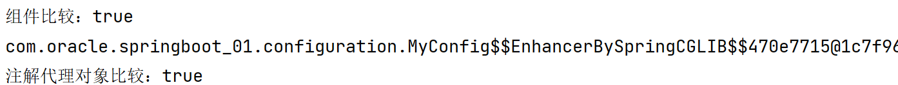


### 5.2.Spring注解

​	除了@Configuration和@Bean外，Spring所提供的@Componet、@Controller、@Service、@Repository也同样适用于Spring Boot:

- @Componet：表示一个组件；
- @Controller：表示一个控制器；
- @Service：表示业务逻辑组件；
- @Repository：表示数据层组件。


### 5.3.@Import

​	@Import注解使用方式和@Configuration类似，它可以同时添加项目中的多个组件包含引入的jar包中的类，我们在MyConfig类上添加这个注解，并添加组件测试：

```java
/*  @Import({User.class, Driver.class})
*       给容器自动创建这两个类型的组件，默认组件的名字就是该类的全类名
*/
@Import({User.class, Driver.class})
```

在**启动类**中测试：

```java
// 测试@Import组件
String[] name = run.getBeanNamesForType(User.class);
for (String s : name) {
     System.out.println(s);
}
Driver driver = run.getBean(Driver.class);
System.out.println(driver);
```


### 5.4.@Conditional

@Conditional可以按照指定的条件进行组件注入。


注释pet方法的@Bean，使该方法没有在容器中创建实例，并注释掉主启动类中关于该方法的代码：

```java
 // @Bean
    public Pet pet() {
        return new Pet("tom猫");
    }
```

在主启动类中检测容器中是否创建了tom猫这个实例：

```java
boolean pet = run.containsBean("pet");
System.out.println("容器中是否包含：" + pet );
boolean user = run.containsBean("user");
System.out.println("容器中是否包含：" + user );
```

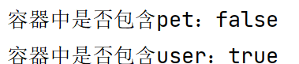

这个时候我们发现pet没有在容器中，但是user还在。如果现在因没有pet而排除user在容器外，我们就可以使用条件注解@ConditionalOnBean

```java
@Bean
@ConditionalOnBean(name = "pet")
public User user() {
     return new User("michela", 20);
}
```

此时再启动主类测试：

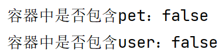


### 5.5.@ImportResource

​	@ImportResource允许我们还是利用xml的方式来创建对象，因为我们此前有了注解@Configuration和@Bean后创建的对象都以注解配置为优先原则，如果还想使用xml创建对象，那么我们就可以利用@ImportResource来完成。在resource下创建spring_config.xml文件，并创建实例对象：

```xml
<?xml version="1.0" encoding="UTF-8"?>
<beans xmlns="http://www.springframework.org/schema/beans"
       xmlns:xsi="http://www.w3.org/2001/XMLSchema-instance"
       xsi:schemaLocation="http://www.springframework.org/schema/beans http://www.springframework.org/schema/beans/spring-beans.xsd">
    <bean id="007" class="com.oracle.springboot_01.bean.User">
        <property name="userName" value="zhangsan"></property>
        <property name="age" value="18"></property>
    </bean>
    <bean id="008" class="com.oracle.springboot_01.bean.Pet">
        <property name="Pname" value="kitty"></property>
    </bean>
</beans>
```

此时我们在主启动类中检测是否包含007和008两个对象，检测发现并不存在：

```java
boolean aa = run.containsBean("007");
System.out.println("容器中是否包含aa：" + aa );
boolean bb = run.containsBean("008");
System.out.println("容器中是否包含bb：" + bb );
```

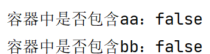

如果我们任然想让这两个对象注册到容器中，我们可以在配置类上加上注解@ImportResource:

```java
@ImportResource
public class MyConfig {...}
```

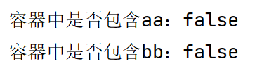

### 5.6.配置绑定

​	在配置数据库等信息时会使用到properties文件内容，我们把它加载到JavaBean中，以供随时使用。在之前可能会用以下操作：

```java
public class getProperties {
     public static void main(String[] args) throws FileNotFoundException, IOException {
         Properties pps = new Properties();
         pps.load(new FileInputStream("application.properties"));
         Enumeration enum1 = pps.propertyNames();//得到配置文件的名字
         while(enum1.hasMoreElements()) {
             String strKey = (String) enum1.nextElement();
             String strValue = pps.getProperty(strKey);
             System.out.println(strKey + "=" + strValue);
             //封装到JavaBean。
         }
     }
 }	
```

- **@ConfigurationProperties**

​	而在springboot中我们可以直接使用注解@ConfigurationProperties。比如我们在bean包中新增类Car:

```java
package com.oracle.springboot_01.bean;

public class Car {
    private String brand; // 品牌
    private Integer price; // 价格

    public String getBrand() {
        return brand;
    }

    public void setBrand(String brand) {
        this.brand = brand;
    }

    public Integer getPrice() {
        return price;
    }

    public void setPrice(Integer price) {
        this.price = price;
    }

    @Override
    public String toString() {
        return "Car{" +
                "brand='" + brand + '\'' +
                ", price=" + price +
                '}';
    }
}
```

​	此时我们在application.propertise文件中添加Car对象的属性值，并在Car类上添加注解，使我们的对象能够通过properties文件赋值：

```properties
mycar.brand=BMW
mycar.price=500000
```

```java
/*
*@Component:将car放到容器中，只有容器中的组件才能配置生效
*ConfigurationProperties读取配置文件中前缀为mycar的属性赋值  */
@Component
@ConfigurationProperties(prefix = "mycar")
public class Car {...}
```

​	在HelloController包中添加测试请求：

```java
@Autowired
    private Car car;
@RequestMapping("/car")
    public Car car() {
        return car;
    }
```

​	发送请求localhost:8888/car得到响应：


- **@EnableConfigurationProperties + @ConfigurationProperties**

  除了用@ConfigurationProperties和@Component配合使用外，我们还可以使用@EnableConfigurationProperties + @ConfigurationProperties进行配置文件的绑定，在配置文件MyConfig中添加注解@EnableConfigurationProperties：

```java
// @EnableConfigurationProperties(Car.class)开启Car类的属性配置功能，并自动注册容器
@Import({User.class, Driver.class})
@Configuration(proxyBeanMethods = false)
@ImportResource
@EnableConfigurationProperties(Car.class)
public class MyConfig {...}
```

​	注释Car类的@Component注解，并请求测试：

```java
// @Component
@ConfigurationProperties(prefix = "mycar")
public class Car {...}
```


### 5.7.SpringBoot启动原理

1. SpringBoot先加载所有的自动配置类  xxxxxAutoConfiguration；
2. 每个自动配置类按照条件进行生效，默认都会绑定配置文件指定的值。xxxxProperties里面拿，xxxProperties和配置文件进行了绑定；
3. 生效的配置类就会给容器中装配很多组件；
4. 只要容器中有这些组件，相当于这些功能就有了
5. 定制化配置：
   1. 用户直接自己@Bean替换底层的组件
   2. 用户去看这个组件是获取的配置文件什么值就去修改。


## 6.开发技巧

### 6.1.lombok

lombok可以简化开发，将注解@Data作用在类上，就可以自动的为我们生成get,set,toString,构造方法等方法。要使用lombok需要在Idea中安装lombok的插件，再引入依赖:

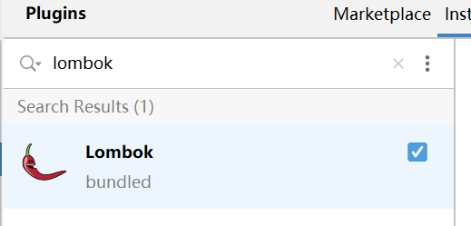

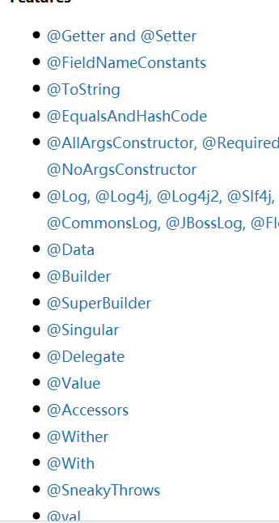


```xml
<dependency>
     <groupId>org.projectlombok</groupId>
      <artifactId>lombok</artifactId>
      <optional>true</optional>
</dependency>
```

在实体类上添加@Data注解即可。


### 6.2.dev-tools

dev-tools是SpringBoot提供的热部署环境，在启动tomcat容器后，如果更改了源代码，需要重启容器才能生效，有了dev-tools之后，只要容器启动，即使修改了源码，也不需要再次启动容器来查看是否生效。

引入依赖：

```xml
<dependency>
     <groupId>org.springframework.boot</groupId>
     <artifactId>spring-boot-devtools</artifactId>
     <optional>true</optional>
</dependency>
```


### 6.3.yaml文件

​	之间我们使用propertise文件来配置，Spring boot还支持采用Yaml文件来进行配置。*YAML*是"YAML Ain't a Markup Language"（YAML不是一种[标记语言](https://baike.baidu.com/item/标记语言)）的[递归缩写](https://baike.baidu.com/item/递归缩写)。在开发的这种语言时，*YAML* 的意思其实是："Yet Another Markup Language"（仍是一种[标记语言](https://baike.baidu.com/item/标记语言)），但为了强调这种语言以数据做为中心，而不是以标记语言为重点，而用反向缩略语重命名。

​	它非常适合用来做以数据为中心的配置文件。

- **基本语法：**

1. key: value；kv之间有空格；
2. 区别大小写；
3. 使用缩进表示层级关系，缩进不能使用tab，只允许使用空格；
4. 缩进的空格数不重要，只能能清楚的表示层级关系就行；
5. 字符串不需要加引号。

**创建application.yml文件：**

```yaml
server:
  port: 8888

spring:
  application:
    name: springboot_01
    
mycar:
  brand: BMW
  price: 50000
```

yaml和application文件在操作spring的配置时是有提示的，但是在做自定义的配置时没有提示，我们可以配置自动配置处理器，这样就可以提示了。

引入依赖：

```xml
<dependency>
      <groupId>org.springframework.boot</groupId>
      <artifactId>spring-boot-configuration-processor</artifactId>
      <optional>true</optional>
</dependency>
```

SpringBoot推荐将打包插件添加配置，这样打包过程中不需要将处理器打包到jar包中，从而减少jar包的大小，达到一种优化。

```xml
 <plugin>
                <groupId>org.springframework.boot</groupId>
                <artifactId>spring-boot-maven-plugin</artifactId>
                <version>2.3.7.RELEASE</version>

                <configuration>
                    <mainClass>com.oracle.springboot_01.Springboot01Application</mainClass>
                    <excludes>
                        <exclude>
                            <groupId>org.springframework.boot</groupId>
                            <artifactId>spring-boot-configuration-processor</artifactId>
                        </exclude>
                    </excludes>
                </configuration>
</pligin>
```


## 7.web开发

### 7.1.简单场景

#### 7.1.1.静态资源的访问

​	Spring boot的静态资源放在/static(或者/public，或/resources，或/META-INF/resources)下，只要访问当前项目的根路径就可以访问到静态资源了，原理是因为它使用到了SpringMVC的ResourceHttpRequestHandler来进行处理。

1.创建spring boot工程，引入如下依赖：


2.在src/main/resource下创建application.yaml文件，分别按静态资源可以存放的路径进行创建---/static(或者/public，或/resources，或/META-INF/resources)，并放一些图片等静态资源在下面：


3.启动项目，访问测试localhost:8080/图片名，这样就可以查看到图片的响应了。

- **原理：**静态资源是映射的/**，当发起请求后先去找Controller去处理，，如果Controller可以处理就返回结果，如果不能响应就找到我当前静态资源的路径去找静态的资源。

  Spring MVC默认的请求资源的配置如下：

  ```propertise
  spring.mvc.static-path-pattern=/resources/**
  ```

  如果需要更改这个请求路径可以在yml中按以下方式进行更改：

  ```yaml
  spring:
    mvc:
      static-path-pattern: /res/**
  
  # 修改默认的访问路径
  resources:
    static-locations: [classpath:/haha/]
  ```

  这个时候再通过localhost:8080/图片名 的方式就没办法访问了，得需要加上访问得前缀res才可以访问得到。


#### 7.1.2.webjars技术(了解)

webjars是以Maven的方式引入web的jar包，我们可以通过webjars的官网https://www.webjars.org/去找到引入方式：

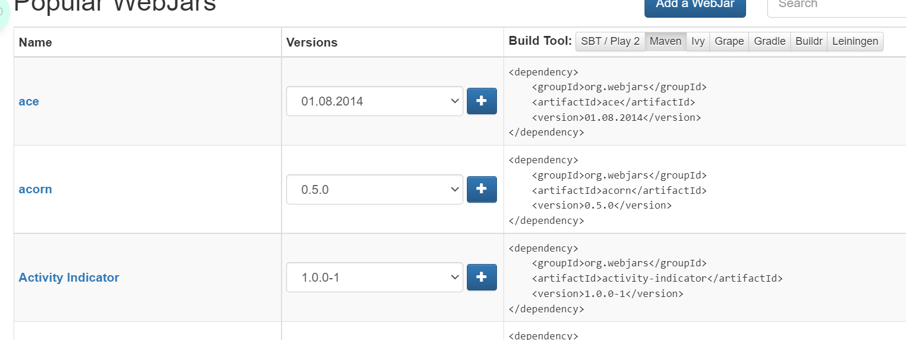

将对应依赖引入到pom.xml文件中，就可以自动映射到默认的静态资源路径下，然后访问得到，如引入以下依赖：

```xml
<dependency>
     <groupId>org.webjars</groupId>
     <artifactId>jquery</artifactId>
     <version>3.5.1</version>
</dependency>
```


访问地址：[http://localhost:8080/webjars/**jquery/3.5.1/jquery.js**](http://localhost:8080/webjars/jquery/3.5.1/jquery.js)   后面地址要按照依赖里面的包路径：


#### 7.1.3.欢迎页

Spring Boot支持两种访问欢迎页的方式：static静态路径下的index.html和通过Controller处理访问找到index.html的页面。

- **通过静态路径访问index.html**

1.删除application.yaml中的自定义路径（不可以配置访问前缀）：

```yaml
#spring:
#  mvc:
#   static-path-pattern: /resources/**
# 修改静态资源默认存放位置
#resources:
#  static-locations: [classpath:/haha/]
```

2.在/static下创建index.html页面：

```html
<!DOCTYPE html>
<html lang="en">
<head>
    <meta charset="UTF-8">
    <title>Title</title>
</head>
<body>
    <h1>欢迎来到Spring boot</h1>
</body>
</html>
```

3.启动容器访问localhost:8080：


- **通过Controller访问index.html:**

1.创建controller包，并创建IndexController类:

```java
package com.sccs.springboot_web.controller;

import org.springframework.stereotype.Controller;
import org.springframework.web.bind.annotation.RequestMapping;


@Controller
public class IndexController {

    @RequestMapping("/hello")
    public String index() {
        return "forward:index.html";
    }
}
```


#### 7.1.4.自定义Favicon

Favicon是访问页面时的网页图标，往往将此图标和网页关联，达到醒目好记得效果。

1.访问https://www.baidu.com/favicon.ico找到图标保存到本地作为图标使用；

2.将图标改名为favicon.ico并放到静态路径下，访问页面显示。由于浏览器存在缓存，可能显示不出来，可以尝试清除缓存或更换浏览器再查看。