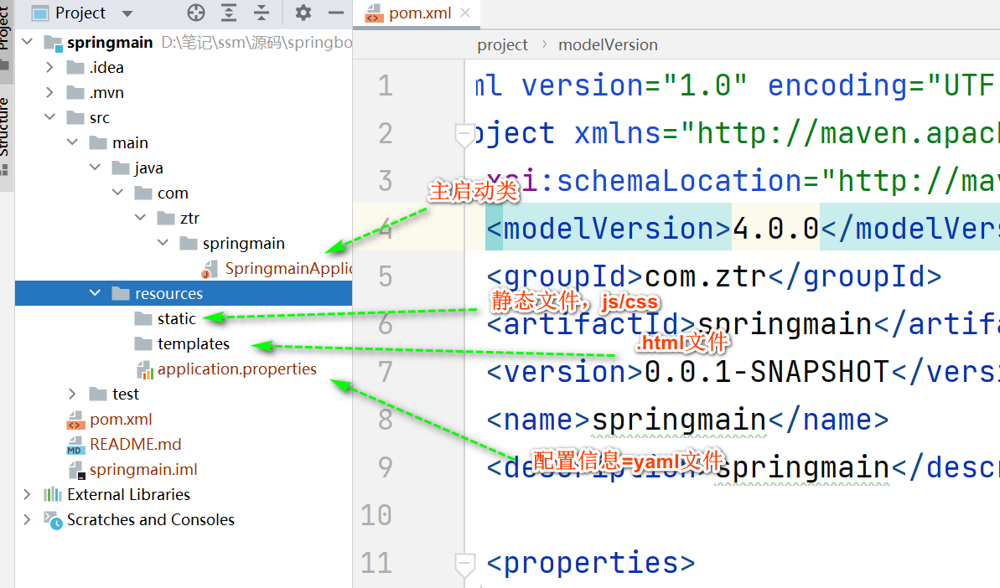

# Spring Boot2集成开发


## 1.创建项目

**打开idea，创建一个springboot项目，项目结构如下：**


**引入spring web依赖：**




**创建controller包，并创建HelloController类，yml文件配置**

```java
# 应用名称
spring:
  application:
    name: springmain

# 应用服务 WEB 访问端口
server:
  port: 8080

```

```java
@RestController
@RequestMapping
public class HelloController {

    @RequestMapping("/hello")
    public String hello() {
        return "Hello World!";
    }
}
```


**模拟用户发起请求查询数据的MVC体系：创建entity.dao,service包，对应类如下：**

```java
package com.ztr.springmain.entity;
@Data
public class UserEntity {

    private Integer id;
    private String name;
    private Integer age;
    private String remark;
}
```

```java
@Repository
public class UserDao {
    // 模拟数据库
    private final ConcurrentMap<Integer,UserEntity> map = new ConcurrentHashMap<>();

    // ID自动生成器
    private final static AtomicInteger idGen = new AtomicInteger();

    // 保存数据
    public boolean save(UserEntity user) {
        int id = idGen.incrementAndGet();
        user.setId(id);
        return map.put(id,user) == null;
    }
    // 根据id查询数据
    public UserEntity selectById(Integer id) {
        return map.get(id);
    }
}
```

```java
@RestController
@RequestMapping("/user")
public class UserController {

    @Autowired
    private UserDao userDao;

    // 查询
    @GetMapping("/get")
    public UserEntity selectById(Integer id) {
        return userDao.selectById(id);
    }

    @PostMapping("/save")
    public UserEntity save(String name,Integer age,String remark) {
        UserEntity user = new UserEntity();
        user.setAge(age);
        user.setName(name);
        user.setRemark(remark);
        boolean rs = userDao.save(user);
        if (rs) {
            System.out.printf("保存成功 %s \n",user);
        }
        return user;

    }

}
```

postman发送请求得到数据：

