Spring框架 SSM

```xml
<?xml version="1.0" encoding="UTF-8"?>
<beans xmlns="http://www.springframework.org/schema/beans"
       xmlns:context="http://www.springframework.org/schema/context"
       xmlns:xsi="http://www.w3.org/2001/XMLSchema-instance"
       xmlns:aop="http://www.springframework.org/schema/aop"
       xsi:schemaLocation="http://www.springframework.org/schema/beans
http://www.springframework.org/schema/beans/spring-beans.xsd
http://www.springframework.org/schema/aop
http://www.springframework.org/schema/aop/spring-aop.xsd
http://www.springframework.org/schema/context
http://www.springframework.org/schema/context/spring-context.xsd">
    
</beans>
```


## 前言

​	Spring框架是Java世界最成功的框架，在企业实际应用中，大部分企业的架构都是基于Spring的。它的成功来自于理念而不是技术，它最核心的理念是IOC（控制反转）和AOP（切面编程），其中IOC是Spring的基础，而AOP是其重要的功能，最典型的就是数据库事物的处理。

​	自2004年第一个版本诞生以来，Spring认为一切Java类都是资源，而资源都是Bean，容纳这些Bean的是Spring所提供的IOC容器，所以Spring是一种基于Bean的编程。其创始人是澳大利亚的Rod Johnson。

​	Spring提供了以下策略：

- 对于POJO的潜力开发，提供轻量级和低侵入的编程，可以通过配置（XML、注解等）来扩展POJO的功能，通过依赖注入的理念去扩展功能，建议通过接口编程，强调OOD（面向对象）的开发理念，降低系统的耦合度，提高系统的可读性和可扩展性。
- 提供切面编程AOP，尤其是把企业的核心应用---数据库应用，通过切面消除了以前复杂的try...catch...finally...的代码结构，使得开发人员能够把精力更加集中于业务而不是技术本身。
- 为了整合各个框架和技术的应用，Spring提供了模板类，通过模板可以整合各个框架和技术，比如支持Mybatis、redis等。


**Spring的特点：**

- 方便解耦，简化开发
- AOP编程支持
- 方便程序测试
- 方便和其他框架的整和
- 支持声明式事务
- 降低API的开发

## 1.Spring入门案例

### 	1.1.下载Spring的稳定版本

​	进入Spring的官网https://spring.io/进行版本的查看，找到当行栏Projects-->Spring Framework查看下载的版本，其中SNAPSHOT为快照版，GA为稳定版，推荐使用GA版本。


​	我们看到目前所使用的稳定版是5.3.16，需要使用它，我们需要访问https://repo.spring.io/ui/native/release/org/springframework/spring/5.3.16/下载对应的版本。


### 1.2.创建工程

​	1.打开idea创建一个普通的Java工程。


2.导入Spring相关的jar包-如下4个以及日志包。


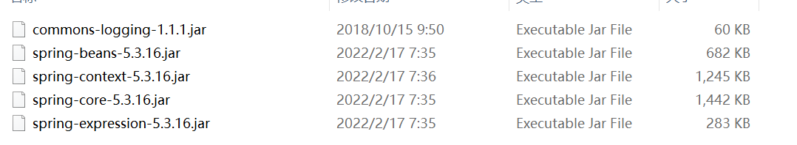

3.在工程下创建lib文件夹，并将jar包粘贴进该文件夹中。


4.导入jar包到项目中：File--Project Structure--Modules--Dependencise--+号--Jars--lib文件夹中所有jar包--Apply。


5.查看项目结构导入的jar包。


6.创建普通类，并在类中创建普通方法。


```java
public class User {
    public void add() {
        System.out.println("add()方法创建了。。。。");
    }

}
```

7.Spring创建对象可以由配置文件做到，也可以由注解做到，这里以配置文件为例，Spring中配置文件以XML文件实现。在包下创建一个spring的xml配置文件，并命名为bean1。


```java
<?xml version="1.0" encoding="UTF-8"?>
<beans xmlns="http://www.springframework.org/schema/beans"
       xmlns:xsi="http://www.w3.org/2001/XMLSchema-instance"
       xsi:schemaLocation="http://www.springframework.org/schema/beans http://www.springframework.org/schema/beans/spring-beans.xsd">
        <!--    配置User类对象的创建
          spring中由bean标签来创建对象，id为对这个对象起的名字
          class为这个对象的全路径类名-->
    <bean id="user" class="com.sccs.spring5.User"></bean>
</beans>
```

8.测试：创建包，创建Test类：

```java
public class TestSpring {

    @Test
    public void testAdd() {
        // 1.加载spring的配置文件
        ClassPathXmlApplicationContext context = new ClassPathXmlApplicationContext("com/sccs/spring5/bean1.xml");
        // 2.获取配置文件的对象
        User user = context.getBean("user", User.class);
        // 3.输出结果
        System.out.println(user);
        user.add();
    }
}
```

9.测试结果：


## 2.Spring IOC容器

​	**控制反转**（Inversion of Controll，缩写为**IoC**），是[面向对象编程](https://baike.baidu.com/item/面向对象编程/254878)中的一种设计原则，可以用来减低计算机[代码](https://baike.baidu.com/item/代码/86048)之间的[耦合度](https://baike.baidu.com/item/耦合度/2603938)。其中最常见的方式叫做**[依赖注入](https://baike.baidu.com/item/依赖注入/5177233)**（Dependency Injection，简称**DI**），还有一种方式叫“依赖查找”（Dependency Lookup）。通过控制反转，对象在被创建的时候，由一个调控系统内所有对象的外界实体将其所依赖的对象的引用传递给它。也可以说，依赖被注入到对象中。

- 工厂模式解耦


​	我们由上面的工厂方式获取对象实现了解耦，但这并不是最佳的解耦方式，IOC就为我们提供了一种特殊的解耦方式，通过XML或者注解的方式进行进一步解耦。


### 2.1.IOC接口

​	IOC的思想是基于IOC容器完成，IOC容器底层就是工厂模式。Spring提供了IOC容器的两种实现方式，也就是BeanFactory接口和ApplicationContext接口。

​	其中BeanFactory接口是Spring内部使用的接口，开发时一般不直接使用。而ApplicationContext接口时BeanFactory的子接口，提供了更多强大的功能，一般由开发人员开发时选用。区别是BeanFactory加载配置文件时不会创建对象，而是在使用时才创建对象。而ApplicationContext在加载配置文件就会创建对象。

​	在idea中ApplicaitonContext接口上右键Diagrams查看它的结构（后者Ctrl+Alt+B），我们可以发现两个非常重要的类:ClassPathXmlApplicationContext和FileSystemApplicationContext。

​	


### 2.2.Bean管理XML的方式

​	**由Spring创建对象和注入属性就是Bean的管理方式。**实现方式有两种：基于xml配置文件和基于注解的方式。

​	在入门案例的User类中增加属性来事项Spring属性的注入。

```java
private String userName;
```

#### 	2.2.1.基于xml配置文件的方式实现

​	在Spring的配置文件中使用bean标签，标签内部添加对应的属性就可以实现。

```xml
id属性：对象的唯一标识
class属性：对象的全路径名，方便IOC加载
name属性：类似于id属性，可以加特殊符号，id属性不可以
```

​	创建对象也是默认执行无参构造创建。IOC中的属性注入被称为DI，在com.sccs.spring5下创建类Book，分别用set注入的方式和有参构造的方式注入对象。

```java
public class Book {
    // 书名
    private String bname;
    // 1.生成set方法注入
    public void setBname(String bname) {
        this.bname = bname;
    }
    // 2.有参构造注入

    public Book(String bname) {
        this.bname = bname;
    }

    public static void main(String[] args) {
        // set注入
//        Book book = new Book();
//        book.setBname("盗墓笔记");

        // 有参注入
        Book book = new Book("盗墓笔记");
        System.out.println(book.bname);

    }
}

```

- **set注入方式：**

​	1.在实际的开发中，我们创建类，生成set方法后，需要在Spring的配置文件中配置对象的信息。我们对以上代码进行改动：

```java
public class Book {
    private String bname;
    private String bauthor;
    // 1.生成set方法注入
    public void setBname(String bname) {
        this.bname = bname;
    }
    public void setBauthor(String bauthor) {
        this.bauthor = bauthor;
    }
     public void test() {
        System.out.println(bname+":"+bauthor);
    }

}
```

```java
<?xml version="1.0" encoding="UTF-8"?>
<beans xmlns="http://www.springframework.org/schema/beans"
       xmlns:xsi="http://www.w3.org/2001/XMLSchema-instance"
       xsi:schemaLocation="http://www.springframework.org/schema/beans http://www.springframework.org/schema/beans/spring-beans.xsd">
        <!--    配置User类对象的创建
          spring中由bean标签来创建对象，id为对这个对象起的名字
          class为这个对象的全路径类名-->
<!--    <bean id="user" class="com.sccs.spring5.User"></bean>-->
<!--    set方法注入属性-->
    <bean id="book" class="com.sccs.spring5.Book">
        <!--     使用property完成属性注入
              name:类里的属性名称
              value:向属性注入值-->
        <property name="bname" value="六脉神剑"></property>
        <property name="bauthor" value="段誉"></property>
    </bean>
</beans>
```

​	2.写测试类TestBook进行测试：

```java
public class TestBook {
    @Test
    public void testBook() {
        ApplicationContext context = new ClassPathXmlApplicationContext("com.sccs.spring5.bean1.xml");
        Book book = context.getBean("book", Book.class);
        System.out.println(book);
        book.test();
    }

}
```

-  **有参构造注入：**

​	1.创建Orders类，并增加属性及生成有参构造：

```java
public class Orders {
    private String oname;
    private String oaddr;
    // 生成有参构造

    public Orders(String oname, String oaddr) {
        this.oname = oname;
        this.oaddr = oaddr;
    }
     public void testOrder() {
        System.out.println(oname+":"+oaddr);
    }
}
```

​	2.在配置文件中注入属性

```xml
<!--    有参构造输入属性-->
    <bean id="orders" class="com.sccs.spring5.Orders">
        <constructor-arg name="oname" value="KFC"></constructor-arg>
        <constructor-arg name="oaddr" value="成都"></constructor-arg>
    </bean>
```

​	3.增加测试类测试

```java
    @Test
    public void test() {
        ApplicationContext context = new ClassPathXmlApplicationContext("com/sccs/spring5/bean1.xml");
        Orders orders = context.getBean("orders", Orders.class);
        System.out.println(orders);
        orders.testOrder();

    }
```

- **p空间注入：**

​	1.以Book类为例，在xml配置文件的头部份增加如下内容：

```xml
xmlns:p="http://www.springframework.org/schema/p"
```

​	2.修改Book的bean标签：

```xml
 <bean id="book" class="com.sccs.spring5.Book" p:bname="降龙十八掌" p:bauthor="乔峰"></bean>
```

​	3.测试

-  **拓展：**

​	在实际开发过程中也有可能注入控制和特殊符号，在Book类中增加address属性，如果对address属性注入null值或特殊符号，可以参考如下操作。

```xml
<!--null 值--> 
<property name="address">
 <null/>
</property> （2）属性值包含特殊符号
<!--属性值包含特殊符号
 1 把<>进行转义 &lt; &gt;
 2 把带特殊符号内容写到 CDATA
-->
<property name="address">
 <value><![CDATA[<<南京>>]]></value>
</property>
```

#### 2.2.2.外部bean、内部bean、级联赋值

- **外部bean**

  在Spring体系架构中，遵循MVC的架构体系，M-Model，V-View，C-Controller，每一层都有一种调用关系，特们的调用方式可以参考如下操作：

1.创建service包和dao包，并创建UserDao类和UserService类，在service中调用dao中的方法：

```java
package com.sccs.spring5.service;

public class UserService {

    public void add() {
        System.out.println("add()方法执行了......");
    }
}
```

```java
package com.sccs.spring5.dao;

public interface UserDao {
    public void update();
}
```

```java
package com.sccs.spring5.dao;

public class UserDaoImpl implements UserDao{
    @Override
    public void update() {
        System.out.println("update()方法执行了....");
    }
}
```

2.在spring的配置文件中进行配置，创建bean2:

​	在UserService中创建UserDao对象，生成构造方法,并在add()方法中调用update()方法：

```java
private UserDao userDao;

    public void setUserDao(UserDao userDao) {
        this.userDao = userDao;
    }
```

```xml
<?xml version="1.0" encoding="UTF-8"?>
<beans xmlns="http://www.springframework.org/schema/beans"
       xmlns:xsi="http://www.w3.org/2001/XMLSchema-instance"
       xsi:schemaLocation="http://www.springframework.org/schema/beans http://www.springframework.org/schema/beans/spring-beans.xsd">
    <!--   1.创建service和dao的对象     -->
    <bean id="userservice" class="com.sccs.spring5.service.UserService">
    <!--  2.注入UserDao对象
         name属性是类中属性的名称
         ref属性是UserDao对象bean标签的id值-->
        <property name="userDao" ref="userDao"></property>
    </bean>
    <bean id="userDao" class="com.sccs.spring5.dao.UserDaoImpl"></bean>
</beans>
```

3.创建TestBean类测试：

```java
public class TestBean {

    @Test
    public void testBean() throws Exception {
        ApplicationContext context = new ClassPathXmlApplicationContext("com/sccs/spring5/bean2.xml");
        UserService userService = context.getBean("userService", UserService.class);
        userService.add();
    }
}
```

- **内部bean**

  在实际的开发过程中往往会遇到一对一，一对多，多对多等关系，在实体类中也会有这种情况。如一个班级有多个学生，一个学生只有一个班级。

  1.创建班级类和学生类，并在学生类中注入Class属性。

```java
package com.sccs.spring5.bean;

public class Cls {
    private String cName;

    public void setcName(String cName) {
        this.cName = cName;
    }
    
    @Override
    public String toString() {
        return "Class{" +
                "cName='" + cName + '\'' +
                '}';
    }
}
```

```java
package com.sccs.spring5.bean;

public class Student {
    private String sName;
    private String gender;
    // 学生属于一个班级，使用对象标识
    private Class cls;

    public void setsName(String sName) {
        this.sName = sName;
    }

    public void setGender(String gender) {
        this.gender = gender;
    }

    public void setCls(Class cls) {
        this.cls = cls;
    }
      public void test() {
        System.out.println(sName+":"+gender+":"+cls);
    }
}

```

2.在Spring的配置文件中进行配置-创建bean3:

```xml
<?xml version="1.0" encoding="UTF-8"?>
<beans xmlns="http://www.springframework.org/schema/beans"
       xmlns:xsi="http://www.w3.org/2001/XMLSchema-instance"
       xsi:schemaLocation="http://www.springframework.org/schema/beans http://www.springframework.org/schema/beans/spring-beans.xsd">
        <!--内部bean-->
        <bean id="student" class="com.sccs.spring5.bean.Student">
            <!--普通属性-->
            <property name="sName" value="Micheal"></property>
            <property name="gender" value="男"></property>
            <!--对象属性-->
            <property name="cls" >
                <bean id="cls" class="com.sccs.spring5.bean.Class">
                    <property name="cName" value="03班"></property>
                </bean>
            </property>
        </bean>
</beans>
```

3.测试

```java
 @Test
    public void testBean2() throws Exception {
        ApplicationContext context = new ClassPathXmlApplicationContext("com/sccs/spring5/bean3.xml");
        Student student = context.getBean("student", Student.class);
        System.out.println(student);
        student.test();
    }
```

- **级联赋值**

  想多个实体类中同时赋值就是级联赋值。

1.创建bean4.xml完成上述案例的级联赋值。

```xml
<?xml version="1.0" encoding="UTF-8"?>
<beans xmlns="http://www.springframework.org/schema/beans"
       xmlns:xsi="http://www.w3.org/2001/XMLSchema-instance"
       xsi:schemaLocation="http://www.springframework.org/schema/beans http://www.springframework.org/schema/beans/spring-beans.xsd">
        <!--级联赋值-->
        <bean id="student" class="com.sccs.spring5.bean.Student">
            <!--普通属性-->
            <property name="sName" value="Micheal"></property>
            <property name="gender" value="男"></property>
            <!--级联赋值-->
            <property name="cls" ref="cls"></property>
        </bean>
        <bean id="cls" class="com.sccs.spring5.bean.Class">
            <property name="cName" value="03班"></property>
        </bean>
</beans>
```

2.修改测试类xml路径为bean4.xml.

```java
  @Test
    public void testBean2() throws Exception {
        ApplicationContext context = new ClassPathXmlApplicationContext("com/sccs/spring5/bean4.xml");
        Student student = context.getBean("student", Student.class);
        System.out.println(student);
        student.test();
    }
```

#### 2.2.3.xml注入集合属性

- **注入数组类型属性**

- **注入list集合类型属性**

- **注入map类集合型属性**

  1.创建一个新的普通Java类命名为spring-demo02，创建新的包com.sccs.spring5.collection，并创建Student类。

  ```java
  public class Student {
      // 1.数组类型
      private String[] course;
      // 2.list集合类型
      private List<String> list;
      // 3.map集合类型
      private Map<String, String> maps;
      // 4.set集合
      private Set<String> set;
      public void setCourse(String[] course) {
          this.course = course;
      }
  
      public void setList(List<String> list) {
          this.list = list;
      }
  
      public void setMaps(Map<String, String> maps) {
          this.maps = maps;
      }
  
      public void setSet(Set<String> set) {
          this.set = set;
      }
      public void test() {
          System.out.println(Arrays.toString(course));
          System.out.println(list);
          System.out.println(maps);
          System.out.println(set);
      }
  }
  ```

  2.创建配置文件spring_config.xml。

  ```xml
  <?xml version="1.0" encoding="UTF-8"?>
  <beans xmlns="http://www.springframework.org/schema/beans"
         xmlns:xsi="http://www.w3.org/2001/XMLSchema-instance"
         xsi:schemaLocation="http://www.springframework.org/schema/beans http://www.springframework.org/schema/beans/spring-beans.xsd">
      <!--创建对象-->
      <bean id="student" class="com.sccs.spring5.conllection.Student">
          <!--数组属性注入-->
          <property name="course" >
              <array>
                  <value>java</value>
                  <value>mysql</value>
              </array>
          </property>
          <!--list属性注入-->
          <property name="list">
              <list>
                  <value>python</value>
                  <value>php</value>
              </list>
          </property>
          <!--map类型属性注入-->
          <property name="maps">
              <map>
                  <entry key="JAVA" value="java"></entry>
                  <entry key="PHP" value="php"></entry>
              </map>
          </property>
          <!--set类型注入-->
          <property name="set">
              <set>
                  <value>Spring</value>
                  <value>Mybatis</value>
              </set>
          </property>
      </bean>
  </beans>
  ```

  3.创建测试类测试--创建test包，创建TestConllection类：

```java
public class TestConllection {

    @Test
    public void testConllection01() {
        ApplicationContext context = new ClassPathXmlApplicationContext("spring-config.xml");
        Student student = context.getBean("student", Student.class);
        System.out.println(student);
        student.test();

    }
}
```

- **在集合里面设置对象类型的值**

1.创建Course类

```java
public class Course {
    private String cName;

    public void setcName(String cName) {
        this.cName = cName;
    }
     @Override
    public String toString() {
        return "Course{" +
                "cName='" + cName + '\'' +
                '}';
    }
}
```

2.在Student类中创建一个list集合属性并生成对应的set方法和toString方法，表示一个学生对应的多门课程

```java
// 5.创建课程集合对象，代表学生所学的多门课程
    private List<Course> courseList;

    public void setCourseList(List<Course> courseList) {
        this.courseList = courseList;
    }
```

3.在配置文件spring_config.xml中进行配置

```xml
	<!--注入对象集合-->
        <property name="courseList">
            <list>
                <ref bean="course1"></ref>
                <ref bean="course2"></ref>
            </list>
        </property>
    </bean>
    <!--创建多个course对象-->
    <bean id="course1" class="com.sccs.spring5.conllection.Course">
        <property name="cName" value="Spring实战"></property>
    </bean>
    <bean id="course2" class="com.sccs.spring5.conllection.Course">
        <property name="cName" value="Spring Boot实战"></property>
    </bean>
```

4.在Student类中的test()方法内增加输出：

```java
System.out.println(courseList);
```

5.执行测试方法。


- **提取集合注入部分**

在实际的开发过程中，如多有多个对象拥有多个公共属性，我们可以提取公共的属性，提高代码的复用性，减少代码量。

1.创建Book类：

```java
package com.sccs.spring5.conllection;

import java.util.List;

public class Book {
    private List<String> list;

    public void setList(List<String> list) {
        this.list = list;
    }
    public void test() {
        System.out.println(list);
    }
}
```

2.创建spring-config02.xml文件并进行提取配置--先在配置文件中引入命名空间：


```xml
<?xml version="1.0" encoding="UTF-8"?>
<beans xmlns="http://www.springframework.org/schema/beans"
       xmlns:xsi="http://www.w3.org/2001/XMLSchema-instance"
       xmlns:p="http://www.springframework.org/schema/p"
       xmlns:util="http://www.springframework.org/schema/util"
       xsi:schemaLocation="http://www.springframework.org/schema/beans http://www.springframework.org/schema/beans/spring-beans.xsd
                            http://www.springframework.org/schema/util http://www.springframework.org/schema/util/spring-util.xsd">
        <!--1.使用util标签抽取list集合属性-->
        <util:list id="bookList">
            <value>Spring Boot实战</value>
            <value>Python程序设计</value>
            <value>Linux程序设计</value>
        </util:list>
        <!--2.使用抽取出来的集合属性-->
    <bean id="book" class="com.sccs.spring5.conllection.Book">
        <property name="list" ref="bookList"></property>
    </bean>
</beans>
```

3.测试

```java
 @Test
    public void testConllection02() {
        ApplicationContext context = new ClassPathXmlApplicationContext("spring-config2.xml");
        Book book = context.getBean("book", Book.class);
        System.out.println(book);
        book.test();

    }
```


#### 2.2.4.Spring内置对象-FactoryBean

​	Spring中有两种Bean，一种是通过我们自己创建的对象，还有一种是Spring中内置的FactoryBean（工厂Bean）。自己创建的对象是在配置文件中配置的类型就是需要返回的类型，而工厂Bean是在配置文件中定义的类型，但可以返回不一样的类型。

1.创建类MyBean，让这个类作为工厂Bean，实现接口FantoryBean，并修改接口的泛型和getObject返回类型。

```java
package com.sccs.spring5.factorybean;

import com.sccs.spring5.conllection.Course;
import org.springframework.beans.factory.FactoryBean;

public class MyBean implements FactoryBean<Course> {
    // 定义返回Bean的返回类型
    @Override
    public Course getObject() throws Exception {
        Course course = new Course();
        course.setcName("Spring框架学习");
        return course;
    }

    @Override
    public Class<?> getObjectType() {
        return null;
    }

    @Override
    public boolean isSingleton() {
        return false;
    }
}
```

2.创建spring-config3.xml实现配置。

```xml
<?xml version="1.0" encoding="UTF-8"?>
<beans xmlns="http://www.springframework.org/schema/beans"
       xmlns:xsi="http://www.w3.org/2001/XMLSchema-instance"
       xmlns:p="http://www.springframework.org/schema/p"
       xmlns:util="http://www.springframework.org/schema/util"
       xsi:schemaLocation="http://www.springframework.org/schema/beans http://www.springframework.org/schema/beans/spring-beans.xsd
                            http://www.springframework.org/schema/util http://www.springframework.org/schema/util/spring-util.xsd">
        <!--创建对象-->
        <bean id="myBean" class="com.sccs.spring5.factorybean.MyBean">

        </bean>
</beans>
```

4.创建测试方法测试。

```java
    @Test
    public void test03() {
        ApplicationContext context = new ClassPathXmlApplicationContext("spring-config3.xml");
        Course course = context.getBean("myBean", Course.class);
        System.out.println(course);
    }
}
```


#### 2.2.5.Bean的作用域

​	**在 Spring里，设置创建的 bean 实例是单实例还是多实例就是Bean的作用域。**在默认情况下，Spring创建的对象是单实例对象。

​	以此前的Book类为例，我们修改测试类，并创建两个对象，并输出这两个类，观察它们的地址值是一样的，这说明在Spring默认配置下所创建的对象是单实例的。

```java
@Test
    public void testConllection02() {
        ApplicationContext context = new ClassPathXmlApplicationContext("spring-config2.xml");
        Book book1 = context.getBean("book", Book.class);
        Book book2 = context.getBean("book", Book.class);
        System.out.println(book1);
        System.out.println(book2);
    }
```


​	那么如果要想设置多实例，该怎样做呢？**在Spring中，bean标签有个属性(scope)，它可以设置单实例还是多实例。默认值是singleton，表示是单实例对象。另外一个常用值是prototype，表示多实例。**

​	我们在spring-config2.xml中增加这个属性，并再次测试输出book1和book2对象观察。

```xml
 <bean id="book" class="com.sccs.spring5.conllection.Book" scope="prototype">
        <property name="list" ref="bookList"></property>
    </bean>
```


​	那么singleton和prototype还有什么区别呢？

1. singleton是单实例，prototype是多实例；
2. 设置scope="singleton"时，加载Spring配置文件的时候就会创建单实例对象，而设置scope="prototype"是在调用getBean()方法的时候才会创建多实例对象。


### 2.3.Bean的生命周期-重点

​	**生命周期是从对象的创建和到对象销毁的过程。**Bean的生命周期分为以下几个阶段：

- 通过构造器创建bean实例-无参构造；
- 为bean的属性设置值和对其他bean的引用-调用set方法；
- 调用bean的初始化方法-需要进行配置；
- 获取实例-使用；
- 当容器关闭，销毁方法被调用-需要配置销毁方法。

1.创建包com.sccs.spring5.bean，并创建类Orders，并设置相关属性：

```java
package com.sccs.spring5.bean;

public class Orders {
    private String oName;
    // 无参构造创建对象
    public Orders() {
        System.out.println("1.执行无参构造创建bean实例。。。。");
    }

    public void setoName(String oName) {
        this.oName = oName;
        System.out.println("2.调用set方法设置属性值。。。。");
    }
    // 创建执行的初始化方法
    public void initMethod() {
        System.out.println("3.执行初始化方法。。。。");
    }
    
    // 创建执行的销毁方法
    public void destroyMethod() {
        System.out.println("5.执行销毁方法。。。。");
    }
}
```

2.创建配置文件spring-config4.xml，并配置对象：

```xml
<?xml version="1.0" encoding="UTF-8"?>
<beans xmlns="http://www.springframework.org/schema/beans"
       xmlns:xsi="http://www.w3.org/2001/XMLSchema-instance"
       xmlns:p="http://www.springframework.org/schema/p"
       xmlns:util="http://www.springframework.org/schema/util"
       xsi:schemaLocation="http://www.springframework.org/schema/beans http://www.springframework.org/schema/beans/spring-beans.xsd
                            http://www.springframework.org/schema/util http://www.springframework.org/schema/util/spring-util.xsd">
        <!--init-method可以自动调用初始化方法
                destroy-method可以自动调用销毁方法-->
        <bean id="orders" class="com.sccs.spring5.bean.Orders" init-method="initMethod" destroy-method="destroyMethod">
                <property name="oName" value="电脑"></property>
        </bean>
</beans>
```

3.测试获取对象：

```java
 @Test
    public void test04() {
        ApplicationContext context = new ClassPathXmlApplicationContext("spring-config4.xml");
        Orders orders = context.getBean("orders", Orders.class);
        System.out.println("4.获取创建bean实例对象。。。。");
        System.out.println(orders);
        // 手动销毁bean对象
        ((ClassPathXmlApplicationContext)context).close();
    }
```

4.执行测试查看结果：


​	其实Spring完整的生命周期还需要后置处理器的支持，完整的步骤是需要在初始化前后加上后置处理器的支持：

- 通过构造器创建bean实例-无参构造；
- 为bean的属性设置值和对其他bean的引用-调用set方法；
- **把 bean 实例传递 bean 后置处理器的方法postProcessBeforeInitialization** 
- 调用bean的初始化方法-需要进行配置；
- **把** **bean** **实例传递** **bean** **后置处理器的方法postProcessAfterInitialization** 
- 获取实例-使用；
- 当容器关闭，销毁方法被调用-需要配置销毁方法。

演示后置处理器的效果：

1.创建后置处理器，创建类MyBeanPost，并实现BeanPostProcessor。

```java
package com.sccs.spring5.bean;

import org.springframework.beans.BeansException;
import org.springframework.beans.factory.config.BeanPostProcessor;

public class MyBeanPost implements BeanPostProcessor {
    @Override
    public Object postProcessBeforeInitialization(Object bean, String beanName) throws BeansException {
        System.out.println("在初始化执行之前执行。。。。");
        return bean;
    }

    @Override
    public Object postProcessAfterInitialization(Object bean, String beanName) throws BeansException {
        System.out.println("在初始化执行之后执行。。。。");
        return bean;
    }
}
```

2.在spring-config4中配置后置处理器。

```xml
<!--配置后置处理器-->
        <bean id="myBeanPost" class="com.sccs.spring5.bean.MyBeanPost"></bean>
```

3.测试查看结果：


### 2.4.xml自动装配

​	自动装配就是**根据指定装配规则（属性名称或者属性类型），Spring 自动将匹配的属性值进行注入**。自动注入不需要手动写<property>标签来完成注入，而是根据bean标签中的autowire属性来完成，autowire属性有两个常用值，值为byName式，表示根据属性的名称来进行自动装配，值为byType时表示根据属性的类型自动注入。

- **根据属性名称自动装备，autowire="byName"**

1.新建包com.sccs.spring5.autowire，新建Emp类和Dept类：

```java
package com.sccs.spring5.autowire;

public class Emp {
    private Dept dept;

    public void setDept(Dept dept) {
        this.dept = dept;
    }

    @Override
    public String toString() {
        return "Emp{" +
                "dept=" + dept +
                '}';
    }
    public void test() {
        System.out.println(dept);
    }
}
```

```java
package com.sccs.spring5.autowire;

public class Dept {
    @Override
    public String toString() {
        return "Dept{}";
    }
}
```

2.新建配置文件sprint-config5.xml，并创建bean对象：

```xml
<?xml version="1.0" encoding="UTF-8"?>
<beans xmlns="http://www.springframework.org/schema/beans"
       xmlns:xsi="http://www.w3.org/2001/XMLSchema-instance"
       xmlns:p="http://www.springframework.org/schema/p"
       xmlns:util="http://www.springframework.org/schema/util"
       xsi:schemaLocation="http://www.springframework.org/schema/beans http://www.springframework.org/schema/beans/spring-beans.xsd
                            http://www.springframework.org/schema/util http://www.springframework.org/schema/util/spring-util.xsd">
        <!--在bean标签中添加autowire属性配置自动属性
                autowire="byName"根据属性的名称注入，注入bean的id值需要和类属性的名称一样；
                autowire="byType"根据类型注入-->
        <bean id="emp" class="com.sccs.spring5.autowire.Emp" autowire="byName">
                <!--<property name="dept" ref="dept"></property>-->
        </bean>

        <bean id="dept" class="com.sccs.spring5.autowire.Dept"></bean>
</beans>
```

3.新建测试方法，测试：

```java
    @Test
    public void test05() {
        ApplicationContext context = new ClassPathXmlApplicationContext("spring-config5.xml");
        Emp emp = context.getBean("emp", Emp.class);
        System.out.println(emp);
    }
```

- **根据类型自动注入，autowire="byType"**

  需要注意的是：根据类型注入时，对象只能有一个。

```xml
<?xml version="1.0" encoding="UTF-8"?>
<beans xmlns="http://www.springframework.org/schema/beans"
       xmlns:xsi="http://www.w3.org/2001/XMLSchema-instance"
       xmlns:p="http://www.springframework.org/schema/p"
       xmlns:util="http://www.springframework.org/schema/util"
       xsi:schemaLocation="http://www.springframework.org/schema/beans http://www.springframework.org/schema/beans/spring-beans.xsd
                            http://www.springframework.org/schema/util http://www.springframework.org/schema/util/spring-util.xsd">
        <!--在bean标签中添加autowire属性配置自动属性
                autowire="byName"根据属性的名称注入，注入bean的id值需要和类属性的名称一样；
                autowire="byType"根据类型注入-->
        <bean id="emp" class="com.sccs.spring5.autowire.Emp" autowire="byType">
                <!--<property name="dept" ref="dept"></property>-->
        </bean>

        <bean id="dept" class="com.sccs.spring5.autowire.Dept"></bean>
</beans>
```


### 2.5.引入外部属性文件

在数据库或其他应用配置时，如果再使用property的标签来配置，灵活性不强，需要修改时也很难寻找对应的属性。所以这时需要将这些配置放到.property的配置中，做到统一管理。

- **直接配置数据库信息**

  1.使用德鲁伊连接池进行连接，引入相关jar包：


​	2.创建spring-config6.xml配置连接池：

```xml
<?xml version="1.0" encoding="UTF-8"?>
<beans xmlns="http://www.springframework.org/schema/beans"
       xmlns:xsi="http://www.w3.org/2001/XMLSchema-instance"
       xmlns:p="http://www.springframework.org/schema/p"
       xmlns:util="http://www.springframework.org/schema/util"
       xsi:schemaLocation="http://www.springframework.org/schema/beans http://www.springframework.org/schema/beans/spring-beans.xsd
                            http://www.springframework.org/schema/util http://www.springframework.org/schema/util/spring-util.xsd">
        <!--配置连接池-->
        <bean id="dataSourse" class="com.alibaba.druid.pool.DruidDataSource">
                <!-- 获取properties文件内容，根据key获取，使用spring表达式获取 -->
                <property name="driverClassName" value="com.mysql.jdbc.Driver" />
                <property name="url" value="jdbc:mysql://localhost:3306/userDb"/>
                <property name="username" value="root"/>
                <property name="password" value="root"/>
        </bean>
</beans>
```

3.上述的方式是正常的配置方式，如果需要修改数据库的相关信息，需要到配置文件中来寻找，非常的麻烦，所以一般情况下，数据库的驱动、连接方式、用户名、密码等都是通过外部方式引入的，创建jdbc.properties文件，该文件的数据类型是k-v结构的。

```text
jdbc.driverClass=com.mysql.jdbc.Driver
jdbc.url=jdbc:mysql://localhost:3306/userDb
jdbc.username=root
jdbc.password=root
```

4.引入jdbc.propertise到spring-config6的配置文件中，但在引入之前，需要先引入context名称空间：


5.用contex:propertise-placeholder标签引入外部文件，并修改配置

```xml
<?xml version="1.0" encoding="UTF-8"?>
<beans xmlns="http://www.springframework.org/schema/beans"
       xmlns:xsi="http://www.w3.org/2001/XMLSchema-instance"
       xmlns:p="http://www.springframework.org/schema/p"
       xmlns:util="http://www.springframework.org/schema/util"
       xmlns:context="http://www.springframework.org/schema/context"
       xsi:schemaLocation="http://www.springframework.org/schema/beans http://www.springframework.org/schema/beans/spring-beans.xsd
                           http://www.springframework.org/schema/util http://www.springframework.org/schema/util/spring-util.xsd
                           http://www.springframework.org/schema/context http://www.springframework.org/schema/context/spring-context.xsd">
        <!--引入外部属性文件-->
        <context:property-placeholder location="classpath:jdbc.propertise"/>
        <!--配置连接池-->
        <bean id="dataSource" class="com.alibaba.druid.pool.DruidDataSource">
                <property name="driverClassName" value="${jdbc.className}"></property>
                <property name="url" value="${jdbc.url}"></property>
                <property name="username" value="${jdbc.userName}"></property>
                <property name="password" value="${jdbc.password}"></property>
        </bean>
</beans>
```


### 2.6.基于注解方式管理Bean

​	注解是代码特殊的标记形式，它的格式如下：

```java
@注解名称(属性名称=属性值,属性名称=属性值)
```

​	注解可以作用域类、方法或属性上，它可以简化Spring的配置。Spring针对于Bean管理创建对象，提供了以下几个注解：

```java
@Component--容器提供的普通注解，用于创建对象
@Service--用在业务逻辑层
@Controller--用在web层
@Repository--用在持久层
// 以上4个注解的功能是一样的，都可以创建对象。
```

#### 2.6.1.基于注解实现对象的创建

1.创建spring_demo03工程，并引入相关jar包：


2.开启组件扫描-告诉Spring容器，需要在哪些包中使用注解，在xml中开启扫描，需要添加上下文命名空间。

```xml
<?xml version="1.0" encoding="UTF-8"?>
<beans xmlns="http://www.springframework.org/schema/beans"
       xmlns:xsi="http://www.w3.org/2001/XMLSchema-instance"
       xmlns:context="http://www.springframework.org/schema/context"
       xsi:schemaLocation="http://www.springframework.org/schema/beans http://www.springframework.org/schema/beans/spring-beans.xsd
                            http://www.springframework.org/schema/context http://www.springframework.org/schema/context/spring-context.xsd">
        <!--开启组件扫描
        1.扫描多个包可以用逗号隔开
        2.也可以扫面上层目录-->
<!--    <context:component-scan base-package="com.sccs.spring.dao,com.sccs.spring.service"></context:component-scan>-->
    <context:component-scan base-package="com.sccs.spring"></context:component-scan>
</beans>
```

3.在service包中创建类UserService，并在类上添加注解实现创建对象。

```java
package com.sccs.spring.service;

import org.springframework.stereotype.Component;
/*
Component注解的value值可以不写，不写是默写为类名首字母小写*/
Component(value="userService")
public class UserService {

    public void test() {
        System.out.println("service的test()方法执行了。。。");
    }

}
```

4.创建测试类测试：

```java
package com.sccs.spring.test;

import com.sccs.spring.service.UserService;
import org.junit.Test;
import org.springframework.context.ApplicationContext;
import org.springframework.context.support.ClassPathXmlApplicationContext;

public class TestBean {

    @Test
    public void test01() {
        ApplicationContext context = new ClassPathXmlApplicationContext("spring-config01.xml");
        UserService userService = context.getBean("userService", UserService.class);
        userService.test();
    }
}
```


#### 2.6.2.组件扫描的细节

```xml
<?xml version="1.0" encoding="UTF-8"?>
<beans xmlns="http://www.springframework.org/schema/beans"
       xmlns:xsi="http://www.w3.org/2001/XMLSchema-instance"
       xmlns:context="http://www.springframework.org/schema/context"
       xsi:schemaLocation="http://www.springframework.org/schema/beans http://www.springframework.org/schema/beans/spring-beans.xsd
                            http://www.springframework.org/schema/context http://www.springframework.org/schema/context/spring-context.xsd">

    <context:component-scan base-package="com.sccs.spring"></context:component-scan>
    <!--   示例1：
        use-default-filters="false"表示不适用现在的filters,自己配置filter
        -->
    <context:component-scan base-package="com.sccs.spring" use-default-filters="false">
        <!--自己配置的filter规则，只扫描Controller注解的包-->
        <context:include-filter type="annotation"
                                expression="org.springframework.stereotype.Controller"/>
    </context:component-scan>

    <!--示例2：
        没有use-default-filters="false"但也使用了自己的设置
        -->
    <context:component-scan base-package="com.sccs.spring">
        <!--配置除了Controller注解不扫描，其他都扫描-->
        <context:exclude-filter type="annotation"
                                expression="org.springframework.stereotype.Controller"/>
    </context:component-scan>
</beans>
```


#### 2.6.3.基于注解实现属性的注入

​	基于属性的注入，Spring提供了如下注解：

```java
@Autowired--根据属性类型自动注入
@Qualifier--根据属性的名称自动注入
@Resource--可以根据类型，也可以根据名称注入
@Value--注入普通类型属性
```

1.在dao包中创建UserDao接口，并创建实现类实现UserDao，在dao上加注解创建对象。

```java
package com.sccs.spring.dao;

public interface UserDao {
    public void add();
}
```

```java
package com.sccs.spring.dao;

import org.springframework.stereotype.Repository;

@Repository
public class UserDaoImpl implements UserDao{
    @Override
    public void add() {
        System.out.println("dao中的add()方法执行了。。。");
    }
}
```

2.在UserService中定义dao类型的属性，并用注解@Autowired注入属性，并在test方法中调用userDao的add方法：

```java
package com.sccs.spring.service;

import com.sccs.spring.dao.UserDao;
import org.springframework.beans.factory.annotation.Autowired;
import org.springframework.stereotype.Component;
/*
Component注解的value值可以不写，不写是默写为类名首字母小写*/
@Component(value="userService")
public class UserService {

    @Autowired
    private UserDao userDao;

    public void test() {
        System.out.println("service的test()方法执行了。。。");
        userDao.add();
    }

}
```

3.运行测试类：


- **使用@Qulifier注解**

  因为@Qulifier注解是根据类型注入，所以如果一个接口有多个实现类的情况下，使用@Autowired注解就没办法根据名称来实现注入，这个时候就需要使用@Qulifier注解，所以它是和@Autowired注解配合使用的。

  ```java
  package com.sccs.spring.service;
  
  import com.sccs.spring.dao.UserDao;
  import org.springframework.beans.factory.annotation.Autowired;
  import org.springframework.beans.factory.annotation.Qualifier;
  import org.springframework.stereotype.Component;
  /*
  Component注解的value值可以不写，不写是默写为类名首字母小写*/
  @Component(value="userService")
  public class UserService {
  
      @Autowired
      @Qualifier(value="userDaoImpl")
      private UserDao userDao;
  
      public void test() {
          System.out.println("service的test()方法执行了。。。");
          userDao.add();
      }
  
  }
  ```

  - **@Resource注解的使用**

  @Resource注解可以根据类型注入，也可以根据名称注入。但@Resource是java提供的扩展包中的注解，而不是Spring框架提供的。

  ```java
  package com.sccs.spring.service;
  
  import com.sccs.spring.dao.UserDao;
  import org.springframework.beans.factory.annotation.Autowired;
  import org.springframework.beans.factory.annotation.Qualifier;
  import org.springframework.stereotype.Component;
  
  import javax.annotation.Resource;
  
  /*
  Component注解的value值可以不写，不写是默写为类名首字母小写*/
  @Component(value="userService")
  public class UserService {
  
      /*@Autowired
      @Qualifier(value="userDaoImpl")
      private UserDao userDao;*/
      // @Resource
      @Resource(name="userDaoImpl") // 根据名称注入
      private UserDao userDao;
      public void test() {
          System.out.println("service的test()方法执行了。。。");
          userDao.add();
      }
  }
  ```

  - **@Value的使用**

  @Value是注入普通类型的属性，而不是注入类属性的注解。

```java
package com.sccs.spring.service;

import com.sccs.spring.dao.UserDao;
import org.springframework.beans.factory.annotation.Autowired;
import org.springframework.beans.factory.annotation.Qualifier;
import org.springframework.beans.factory.annotation.Value;
import org.springframework.stereotype.Component;

import javax.annotation.Resource;

/*
Component注解的value值可以不写，不写是默写为类名首字母小写*/
@Component(value="userService")
public class UserService {

    // 注入普通属性
    @Value(value="james")
    private String name;
    @Resource(name="userDaoImpl") // 根据名称注入
    private UserDao userDao;
    public void test() {
        System.out.println("service的test()方法执行了。。。");
        userDao.add();
        System.out.println(name);
    }
}
```


#### 2.6.4.完全注解的开发

​	在我们之前都是使用配置文件来操作对象和属性，在实际的开发中，为了提高开发效率，我们在代码层面可以完全使用注解来进行开发，减少配置文件的使用。

1.创建包com.sccs.spring.config，配置类SpringConfig来替代xml配置文件，并删除spring-config01.xml文件

```java
package com.sccs.spring.config;

import org.springframework.context.annotation.ComponentScan;
import org.springframework.context.annotation.Configuration;

@Configuration // 将当前类作为配置类
@ComponentScan(basePackages = {"com.sccs.spring"})
public class SpringConfig {
}
```

2.编写test02()方法，并用AnnotationConfigApplicationContext类来查找配置文件，创建context对象：

```java
 	@Test
    public void test02() {
        ApplicationContext context = new AnnotationConfigApplicationContext(SpringConfig.class);
        UserService userService = context.getBean("userService", UserService.class);
        userService.test();
    }
```


## 3.SpringAOP切面编程

​	AOP是面向切面编程，利用AOP可以对业务逻辑的各个部分进行分离，，从而使得业务逻辑之间的耦合度降低，提高程序的可重用性，同时提高开发的效率。AOP不用修改源代码，在主干分支里面添加新的功能。

​	

### 3.1.AOP底层原理

​	AOP底层采用了动态代理，而动态代理分为两种：JDK动态代理和CGLIB动态代理。

- **在有接口的情况下，使用JDK动态代理**


- **在没有接口的情况下，使用CGLIB动态代理**


#### 3.1.1.JDK动态代理的实现

1.使用 JDK 动态代理，使用 Proxy 类里面的方法创建代理对象


​	我们要使用的就是newProxyInstance()这个方法，它的参数有三个：

- 第一个参数：loader表示类的加载器；
- 第二个参数：interfaces表示增强方法所在的类，这个类的实现接口，支持多接口；
- 第三个参数：实现这个接口InvacationHandler，创建代理对象，写增强方法。

2.创建spring_demo04工程，再创建接口和实现类

```java
package com.sccs.spring.dao;

public interface UserDao {

    public int add(int a, int b);

    public String update(String id);
}
```

```java
package com.sccs.spring.dao;

public class UserDaoImpl implements UserDao{
    @Override
    public int add(int a, int b) {
        System.out.println("add()方法执行了。。。");
        return a+b;
    }

    @Override
    public String update(String id) {
        System.out.println("update()方法执行了。。。");
        return id;
    }
}
```

3.创建代理对象JDKProxy，并创建UserDaoProxy类实现InvocationHandler写增强的业务逻辑。

```java
package com.sccs.spring.proxy;

import com.sccs.spring.dao.UserDao;
import com.sccs.spring.dao.UserDaoImpl;

import java.lang.reflect.Array;
import java.lang.reflect.InvocationHandler;
import java.lang.reflect.Method;
import java.lang.reflect.Proxy;
import java.util.Arrays;

public class JDKProxy {
    public static void main(String[] args) {
        // 创建接口实现类的代理对象
        Class[] interfaces = {UserDao.class};
        UserDaoImpl userDao = new UserDaoImpl();
        UserDao dao = (UserDao) Proxy.newProxyInstance(JDKProxy.class.getClassLoader(), interfaces, new UserDaoProxy(userDao));
        int result = dao.add(1, 2);
        System.out.println("result="+result);
    }
}

// 创建InvocationHandler的代理类
class UserDaoProxy implements InvocationHandler {
    // 创建UserDaoImpl的代理对象，把它传递过来
    private Object obj;
    public UserDaoProxy(Object obj) {
        this.obj = obj;
    }
    // 书写增强逻辑
    @Override
    public Object invoke(Object proxy, Method method, Object[] args) throws Throwable {
        // 方法之前
        System.out.println("方法之前执行。。。。"+method.getName()+";传递的参数："+ Arrays.toString(args));
        // 被增强的方法执行
        Object res = method.invoke(obj,args);
        // 方法之后
        System.out.println("方法之后执行。。。。"+obj);
        return res;
    }
}
```

4.测试main方法的结果：


### 3.2.AOP的相关术语

- **连接点：**类里的方法可以被增强，这些方法就是连接点
- **切入点：**实际被增强的方法就是切入点
- **通知（增强）：**实际增强的业务逻辑，分为前置通知，后置通知，环绕通知，异常通知，最终通知
- **切面：**把通知应用到切入点的过程


### 3.3.AOP的操作

​	Spring实现AOP的操作一般通过AspectJ，AspectJ并不是Spring的组成部分，它是独立的AOP框架。基于AspectJ实现AOP也可以通过xml配置文件和注解的方式来完成。

1.引入AOP相关的依赖：


2.完成切入点表达式：作用是知道哪个类的哪个方式进行增强，语法结构为：

```java
execution([权限修饰符][返回类型][类的全路径名称][方法名称]([参数列表]))
// 例
execution(public com.sccs.dao.UserDao.add(args...))
```


#### 3.3.1.基于注解方式

1.创建类，定义一个方法，把这个方法作为增强方法：

```java
package com.sccs.spring.aopanno;

public class User {
    public void add() {
        System.out.println("add()方法执行了。。。");
    }
}
```

2.创建增强类，编写增强逻辑，并创建不同的方法实现不同的通知类型：

```java
package com.sccs.spring.aopanno;

//增强类，实现不同的通知
public class UserProxy {
    // 前置通知-在增强方法之前增强
    public void before() {
        System.out.println("before()前置通知...");
    }
}
```

3.在src下创建spring_aop.xml增加context和aop命名空间配置注解扫描

```xml
<?xml version="1.0" encoding="UTF-8"?>
<beans xmlns="http://www.springframework.org/schema/beans"
       xmlns:xsi="http://www.w3.org/2001/XMLSchema-instance"
       xmlns:context="http://www.springframework.org/schema/context"
        xmlns:aop="http://www.springframework.org/schema/aop"
       xsi:schemaLocation="http://www.springframework.org/schema/beans http://www.springframework.org/schema/beans/spring-beans.xsd
                            http://www.springframework.org/schema/context http://www.springframework.org/schema/context/spring-context.xsd
                            http://www.springframework.org/schema/aop http://www.springframework.org/schema/aop/spring-aop.xsd">
        <!--开启组件扫描-->
    <context:component-scan base-package="com.sccs.spring.aopanno"></context:component-scan>
</beans>
```

4.使用@Component注解创建User和UserProxy对象：


5.在增强类上加注解@AspectJ，让这个类称为一个代理对象：


6.在Spring配置文件中开启生成代理对象：

```xml
<!--开启aspectJ生成代理对象-找@AspectJ注解，将这个注解所在的类生成代理对象-->
<aop:aspectj-autoproxy></aop:aspectj-autoproxy>
```

7.配置不同类型的通知-在增强类的增强方法上添加通知类型注解，使用切入点表达式配置：

```java
package com.sccs.spring.aopanno;

import org.aspectj.lang.annotation.Before;
import org.springframework.stereotype.Component;

//增强类，实现不同的通知
@Component
public class UserProxy {
    // 前置通知-在增强方法之前增强
    // @Before表示前置通知
    @Before(value = "execution(* com.sccs.spring.aopanno.User.add(..))")
    public void before() {
        System.out.println("before()前置通知...");
    }
}
```

8.创建测试包和测试类进行测试：

```java
package com.sccs.spring.test;

import com.sccs.spring.aopanno.User;
import org.junit.Test;
import org.springframework.context.ApplicationContext;
import org.springframework.context.support.ClassPathXmlApplicationContext;

public class TestAOP {

    @Test
    public void test01() {
        ApplicationContext context = new ClassPathXmlApplicationContext("speing_aop.xml");
        User user = context.getBean("user", User.class);
        user.add();
    }
}
```


9.在UserProxy中创建其他几种通知类型并测试：

```java
 // 最终通知
    @After(value = "execution(* com.sccs.spring.aopanno.User.add(..))")
    public void after() {
        System.out.println("after()方法执行了。。。");
    }
    // 后置通知
    @AfterReturning(value = "execution(* com.sccs.spring.aopanno.User.add(..))")
    public void afterReturning() {
        System.out.println("afterReturning()方法执行了。。。");
    }
    //异常通知
    @AfterThrowing(value = "execution(* com.sccs.spring.aopanno.User.add(..))")
    public void afterThrowing() {
        System.out.println("afterThrowing()方法执行了。。。");
    }
    // 环绕通知
    @Around(value = "execution(* com.sccs.spring.aopanno.User.add(..))")
    public void around(ProceedingJoinPoint point) throws Throwable {
        System.out.println("around()方法环绕之前。。。");
        // 被增强的方法执行
        point.proceed();
        System.out.println("around()方法环绕之后。。。");
    }
```


after()表示在方法之后执行，afterReturning()表示在方法之后返回结果后执行。


#### 3.3.2.重用切入点

​	我们由上述案例可以看出，尽管通知方法有5种，但它们都具有相同的切入点表达式，所以我们代码的流畅和增加开发效率，我们可以将相同的切入点表达式进行向上抽取。

```java
    // 相同切入点的抽取
    @Pointcut(value = "execution(* com.sccs.spring.aopanno.User.add(..))")
    public void point() {

    }
    // 前置通知-在增强方法之前增强
    // @Before表示前置通知
    @Before(value = "point()")
    public void before() {
        System.out.println("before()前置通知...");
    }
```


#### 3.3.3.增强类的优先级

​	如果有多个类的同一方法进行增强，我们可以设置它们的优先级。

1.创建PersonProxy类，并创建beafore()方法，也对User类的add()方法进行增强：

```java
package com.sccs.spring.aopanno;

import org.aspectj.lang.annotation.Aspect;
import org.aspectj.lang.annotation.Before;
import org.springframework.core.annotation.Order;
import org.springframework.stereotype.Component;

@Component
@Aspect
@Order(1)
public class PersonProxy {

    @Before(value = "execution(* com.sccs.spring.aopanno.User.add(..))")
    public void before() {
        System.out.println("Person类的before()执行了。。。。");
    }
}

```

2.在增强类的上面添加注解@Order设置优先级，@Order注解的值越小，优先级越高：


3.测试：


#### 3.3.4.完全注解开发

1.创建config包，并创建配置类AopConfig:

```java
package com.sccs.spring.config;

import org.springframework.context.annotation.ComponentScan;
import org.springframework.context.annotation.Configuration;
import org.springframework.context.annotation.EnableAspectJAutoProxy;

@Configuration
@ComponentScan(basePackages = {"com.sccs.spring"})
@EnableAspectJAutoProxy(proxyTargetClass = true)
public class AopConfig {
}
```

2.创建测试方法测试：

```java
    @Test
    public void test03() {
        ApplicationContext context = new 			AnnotationConfigApplicationContext(AopConfig.class);
        User user = context.getBean("user", User.class);
        user.add();
    }
```


#### 3.3.5.基于配置文件方式

1.创建增强类和被增强类，并创建增强方法：

```java
package com.sccs.spring.aopxml;

public class Book {

    public void buy() {
        System.out.println("buy()方法执行了。。。");
    }
}
```

```java
package com.sccs.spring.aopxml;

public class BookProxy {

    public void before() {
        System.out.println("before()方法执行了。。。");
    }
}
```

2.在sprint_aop02.xml配置文件中创建对象，并配置AOP增强：

```xml
<?xml version="1.0" encoding="UTF-8"?>
<beans xmlns="http://www.springframework.org/schema/beans"
       xmlns:xsi="http://www.w3.org/2001/XMLSchema-instance"
       xmlns:context="http://www.springframework.org/schema/context"
        xmlns:aop="http://www.springframework.org/schema/aop"
       xsi:schemaLocation="http://www.springframework.org/schema/beans http://www.springframework.org/schema/beans/spring-beans.xsd
                            http://www.springframework.org/schema/context http://www.springframework.org/schema/context/spring-context.xsd
                            http://www.springframework.org/schema/aop http://www.springframework.org/schema/aop/spring-aop.xsd">
        <!--创建对象-->
        <bean id="book" class="com.sccs.spring.aopxml.Book"></bean>
        <bean id="bookProxy" class="com.sccs.spring.aopxml.BookProxy"></bean>

        <!--配置AOP增强-->
        <aop:config>
                <!--配置切入点-->
                <aop:pointcut id="p" expression="execution(* com.sccs.spring.aopxml.Book.buy(..))"/>
                <!--配置切面-->
                <aop:aspect ref="bookProxy">
                        <!--配置增强作用到方法上-->
                        <aop:before method="before" pointcut-ref="p"></aop:before>
                </aop:aspect>
        </aop:config>
</beans>
```

3.创建测试方法测试：

```java
 @Test
    public void test02() {
        ApplicationContext context = new ClassPathXmlApplicationContext("spring_aop02.xml");
        Book book = context.getBean("book", Book.class);
        book.buy();
    }
```


## 4.JDBCTemplate

​	Spring框架对JDBC进行了封装，使用JDBCTemplate能实现对数据库高效方便的操作。


### 4.1.准备工作

- 1.引入jar包，构建依赖


- 2.创建spring_config01.xml文件，并配置数据库连接池：

```xml
<?xml version="1.0" encoding="UTF-8"?>
<beans xmlns="http://www.springframework.org/schema/beans"
       xmlns:xsi="http://www.w3.org/2001/XMLSchema-instance"
       xsi:schemaLocation="http://www.springframework.org/schema/beans http://www.springframework.org/schema/beans/spring-beans.xsd">
<!--数据库连接池-->
    <bean id="dataSource" class="com.alibaba.druid.pool.DruidDataSource" destroy-method="close">
        <property name="url" value="jdbc:mysql://localhost:3306/tb_user?useUnicode=true&amp;characterEncoding=utf8"></property>
        <property name="username" value="root"></property>
        <property name="password" value="root"></property>
        <property name="driverClassName" value="com.mysql.jdbc.Driver"></property>
    </bean>
</beans>
```

- 3.用navicat创建对应的数据库user_db，并创建t_book表，增加字段book_id,bookname,bstatus
- 4.在spring_config01.xml中配置JDBCTemplate对象，注入DataSource:

```xml
    <!--jdbcTemplate对象-->
    <bean id="jdbcTemplate" class="org.springframework.jdbc.core.JdbcTemplate">
        <!--set注入dataSource-->
        <property name="dataSource" ref="dataSource"></property>
    </bean>
```

- 5.创建dao包BookDao接口和BookDaoImpl实现类，service包接口BookService类，在dao中注入jdbcTemplate对象：

```java
package com.sccs.spring.dao;

public interface BookDao {
}
```

```java
package com.sccs.spring.dao;

import org.springframework.beans.factory.annotation.Autowired;
import org.springframework.jdbc.core.JdbcTemplate;
import org.springframework.stereotype.Repository;

@Repository
public class BookDaoImpl implements BookDao{

    // 注入jdbcTemplate
    @Autowired
    private JdbcTemplate jdbcTemplate;
}
```

```java
package com.sccs.spring.service;

import com.sccs.spring.dao.BookDao;
import org.springframework.beans.factory.annotation.Autowired;
import org.springframework.stereotype.Service;

@Service
public class BookServcie {
    // 输入Dao
    @Autowired
    private BookDao bookDao;
}
```

- 6.在spring_config01.xml中开启注解扫描：

```xml
<!--开启注解扫描-->
    <context:component-scan base-package="com.sccs.spring"></context:component-scan>
```


### 4.2.对数据库增删改操作

- **添加**

1.增加对应数据库的实体类：

```java
package com.sccs.spring.entity;

public class Book {
    private String bookId;
    private String bookname;
    private String bstatus;

    public String getBookId() {
        return bookId;
    }

    public void setBookId(String bookId) {
        this.bookId = bookId;
    }

    public String getBookname() {
        return bookname;
    }

    public void setBookname(String bookname) {
        this.bookname = bookname;
    }

    public String getBstatus() {
        return bstatus;
    }

    public void setBstatus(String bstatus) {
        this.bstatus = bstatus;
    }
}
```

2.编写dao和service，实现数据库添加方法：

```java
// 添加
void addBook(Book book);
```

```java
    @Override
    public void addBook(Book book) {
        // 1.创建sql
        String sql = "insert into t_book values(?,?,?)";
        /*
        * 第一个参数为sql语句，第二个参数为可变参数，sql语句值*/
        int result = jdbcTemplate.update(sql,book.getBookId(),book.getBookname(),book.getBstatus());
        System.out.println(result);
    }
```

```java
public void addBook(Book book) {
        bookDao.addBook(book);
    }
```

3.新建测试类，完成测试：

```java
   @Test
    public void testadd() {
        ApplicationContext context = new ClassPathXmlApplicationContext("spring_config01.xml");
        BookService bookService = context.getBean("bookService", BookService.class);
        Book book = new Book();
        book.setBookId("01");
        book.setBookname("天龙八部");
        book.setBstatus("1");
        bookService.addBook(book);

    }
```


- **修改删除**

1.在dao和service添加修改和删除的方法：

```java
    // 修改
    public void updateBook(Book book){
        bookDao.updateBook(book);
    }
    // 删除
    public void deleteBook(String id) {
        bookDao.deleteBook(id);
    }
```

```java
   // 修改
    void updateBook(Book book);
    // 删除
    void deleteBook(String id);
```

```java
    @Override
    public void updateBook(Book book) {
        String sql = "update t_book set bookname = ?,bstatus = ? where book_id = ?";
        Object[] args = {book.getBookId(),book.getBookname(),book.getBstatus()};
        int update = jdbcTemplate.update(sql, args);
        System.out.println(update);
    }

    @Override
    public void deleteBook(String id) {
        String sql = "delete from t_book where book_id = ?";
        int delete = jdbcTemplate.update(sql, id);
        System.out.println(delete);
    }
```

2.创建测试方法测试：

```java
    @Test
    public void testupdate() {
        ApplicationContext context = new ClassPathXmlApplicationContext("spring_config01.xml");
        BookService bookService = context.getBean("bookService", BookService.class);
        Book book = new Book();
        book.setBookId("01");
        book.setBookname("笑傲江湖01");
        book.setBstatus("01");
        bookService.updateBook(book);

    }
    @Test
    public void testdelete() {
        ApplicationContext context = new ClassPathXmlApplicationContext("spring_config01.xml");
        BookService bookService = context.getBean("bookService", BookService.class);
        bookService.deleteBook("01");

    }
```

### 4.3.查询操作

#### 4.3.1.查询返回某个值

1.在BookService中创建方法：

```java
  // 查询返回某个值
    public int findCount() {
        bookDao.selectBookCount();
    }
```

2.在BookDao和BookDaoImpl中创建对应方法：

```java
 // 查询
 int selectBookCount();
```

```java
// 查询记录数
    @Override
    public int selectBookCount() {
        String sql = "select count(*) from t_book";
        Integer count = jdbcTemplate.queryForObject(sql, Integer.class);
        return count;
    }
```

3.测试：

```java
    @Test
    public void testquery() {
        ApplicationContext context = new ClassPathXmlApplicationContext("spring_config01.xml");
        BookService bookService = context.getBean("bookService", BookService.class);
        int count = bookService.findCount();
        System.out.println("count = " + count);
        
    }
```

#### 4.3.2.查询返回对象

1.在BookService中创建方法：

```java
// 查询返回对象
    public Book findObject(String bookId) {
        return bookDao.findObject(bookId);
    }
```

2.在BookDao和实现类中创建对应的方法，并完成业务操作：

```java
 //查询返回对象
    Book findObject(String bookId);
```

```java
@Override
    public Book findObject(String bookId) {
        String sql = "select * from t_book where book_id=?";
        // rowmapper是Spring提供的一个接口，返回不同类型的数据，使用这个接口的实现类，完成数据的封装
        Book book = jdbcTemplate.queryForObject(sql, new BeanPropertyRowMapper<Book>(Book.class), bookId);
        return book;
    }
```

3.生成Book类的toString方法：

```java
 @Override
    public String toString() {
        return "Book{" +
                "bookId='" + bookId + '\'' +
                ", bookname='" + bookname + '\'' +
                ", bstatus='" + bstatus + '\'' +
                '}';
    }
```

4.测试：

```java
 @Test
    public void testqueryObject() {
        ApplicationContext context = new ClassPathXmlApplicationContext("spring_config01.xml");
        BookService bookService = context.getBean("bookService", BookService.class);
        Book book = bookService.findObject("111");
        System.out.println(book);

    }
```

#### 4.3.3.查询返回集合

1.在BookService中创建方法：

```java
// 查询返回集合
    public List<Book> findList() {
        return bookDao.findList();
    }
```

2.在BookDao和实现类中创建对应方法，并完成业务实现：

```java
// 查询返回集合
    List<Book> findList();
```

```java
 @Override
    public List<Book> findList() {
        String sql = "select * from t_book";
        List<Book> bookList = jdbcTemplate.query(sql, new BeanPropertyRowMapper<Book>(Book.class));
        return bookList;
    }
```

3.创建测试方法：

```java
@Test
    public void testqueryList() {
        ApplicationContext context = new ClassPathXmlApplicationContext("spring_config01.xml");
        BookService bookService = context.getBean("bookService", BookService.class);
        List<Book> bookList = bookService.findList();
        System.out.println(bookList);

    }
```


### 4.4.实现对数据库的批量操作

​	批量操作指操作表中的多条数据。


#### 4.4.1.批量添加

1.在BookService中添加批量添加的方法：

```java
// 批量添加
    public void batchAdd(List<Object[]> batchArgs) {
        bookDao.batchAddBook(batchArgs);
    }
```

2.在BookDao和实现类中完成批量操作：

```java
// 实现批量添加
    void batchAddBook(List<Object[]> batchArgs);
```

```java
@Override
    public void batchAddBook(List<Object[]> batchArgs) {
        String sql = "insert into t_book values(?,?,?)";
        int[] ints = jdbcTemplate.batchUpdate(sql, batchArgs);
        System.out.println(Arrays.toString(ints));

    }
```

3.创建测试方法：

```java
@Test
    public void testBatchUpdate() {
        ApplicationContext context = new ClassPathXmlApplicationContext("spring_config01.xml");
        BookService bookService = context.getBean("bookService", BookService.class);
        List<Object[]> list = new ArrayList<Object[]>();
        Object[] obj1 = {"333","红楼梦","2"};
        Object[] obj2 = {"444","西游记","2"};
        Object[] obj3 = {"555","三国演义","1"};
        Object[] obj4 = {"666","水浒传","1"};
        Object[] obj5 = {"777","西厢记","2"};
        list.add(obj1);
        list.add(obj2);
        list.add(obj3);
        list.add(obj4);
        list.add(obj5);
        bookService.batchAdd(list);
```

#### 4.4.2.批量修改

1.在BookService中创建批量修改方法：

```java
// 批量修改
    public void batchUpdate(List<Object[]> batchArgs) {
        bookDao.batchUpdate(batchArgs);
    }
```

2.在BookDao和实现类中实现批处理修改：

```java
 void batchUpdate(List<Object[]> batchArgs);
```

```java
@Override
    public void batchUpdate(List<Object[]> batchArgs) {
        String sql = "update t_book set bookname = ?,bstatus = ? where book_id = ?";
        int[] ints = jdbcTemplate.batchUpdate(sql, batchArgs);
        System.out.println(Arrays.toString(ints));

    }
```

3.测试：

```java
@Test
    public void testBatchUpdate02() {
        ApplicationContext context = new ClassPathXmlApplicationContext("spring_config01.xml");
        BookService bookService = context.getBean("bookService", BookService.class);
        List<Object[]> list = new ArrayList<Object[]>();
        Object[] obj1 = {"红楼梦-贾宝玉","1","333"};
        Object[] obj2 = {"西游记-孙悟空","1","444"};
        list.add(obj1);
        list.add(obj2);
        bookService.batchUpdate(list);

    }
```

#### 4.4.3.批量删除

1.在BookService中新增方法：

```java
// 批量修改
    public void batchDelete(List<Object[]> batchArgs) {
        bookDao.batchDelete(batchArgs);
    }
```

2.在BookDao和实现类中书写批处理删除：

```java
void batchDelete(List<Object[]> batchArgs);
```

```java
@Override
    public void batchDelete(List<Object[]> batchArgs) {
        String sql = "delete from t_book where book_id = ?";
        int[] ints = jdbcTemplate.batchUpdate(sql, batchArgs);
        System.out.println(Arrays.toString(ints));
    }
```

3.测试：

```java
@Test
    public void testBatchDelete() {
        ApplicationContext context = new ClassPathXmlApplicationContext("spring_config01.xml");
        BookService bookService = context.getBean("bookService", BookService.class);
        List<Object[]> list = new ArrayList<Object[]>();
        Object[] obj1 = {"333"};
        Object[] obj2 = {"444"};
        list.add(obj1);
        list.add(obj2);
        bookService.batchDelete(list);
    }
```


## 5.Spring事务管理


### 5.1.1什么是事务

​	数据库事务( transaction)是访问并可能操作各种[数据项](https://baike.baidu.com/item/数据项/3227309)的一个数据库操作[序列](https://baike.baidu.com/item/序列/1302588)，这些操作**要么全部执行,要么全部不执行**，是一个不可分割的工作单位。事务由事务开始与事务结束之间执行的全部数据库操作组成。

​	数据库事务的四个特性：

- **原子性**：要么都成功，要么都失败；
- **一致性**：操作的前后总量不变；
- **隔离性**：多事务间互不影响；
- **持久性**：提交到数据库的持久。


### 5.2.搭建事务环境

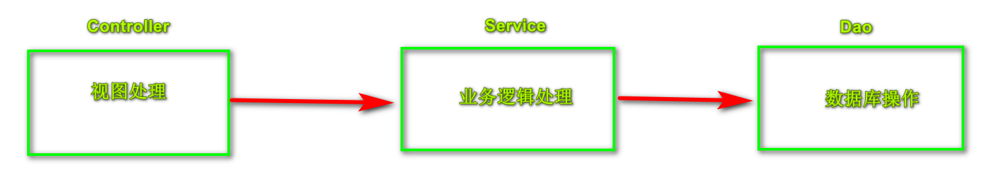

我们以常见的银行转账的方式，在Dao层实现转账和收款的操作，在Service层完成这个逻辑。在数据库tb_user中创建账户表acount，并添加两条数据进行测试，表结构和字段如下：

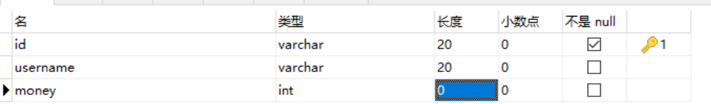

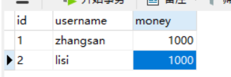


- **创建项目spring_transaction引入相关jar包，并创建Service和Dao，配置连接池，完成属性注入-在Service中注入Dao，在Dao中注入JdbcTemplate，在JdbcTemplate中注入DataSource:**

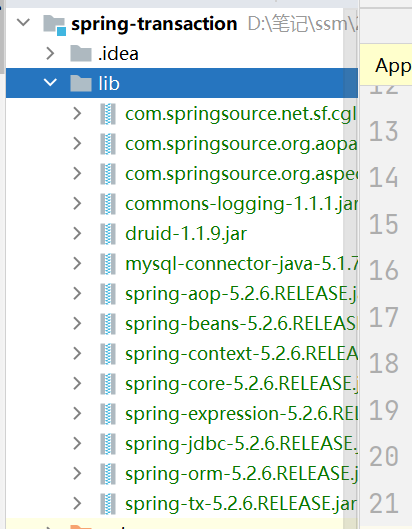

```properties
jdbc.driverClass=com.mysql.jdbc.Driver
jdbc.URL=jdbc:mysql://localhost:3306/tb_user?userUnicode=true&characterEncoding=utf-8&useSSL=false
jdbc.username=root
jdbc.password=root
```

```xml
<?xml version="1.0" encoding="UTF-8"?>
<beans xmlns="http://www.springframework.org/schema/beans"
       xmlns:context="http://www.springframework.org/schema/context"
       xmlns:xsi="http://www.w3.org/2001/XMLSchema-instance"
       xsi:schemaLocation="http://www.springframework.org/schema/beans http://www.springframework.org/schema/beans/spring-beans.xsd
        http://www.springframework.org/schema/context http://www.springframework.org/schema/context/spring-context.xsd">
    <!--外部文件引入-->
    <context:property-placeholder location="classpath:com/sccs/spring/jdbc.propertise"></context:property-placeholder>
    <!--组件扫描-->
    <context:component-scan base-package="com.sccs.spring"></context:component-scan>
    <!--配置连接池-->
    <bean id="dataSource" class="com.alibaba.druid.pool.DruidDataSource"
                            destroy-method="close">
        <property name="driverClassName" value="${jdbc.driverClass}"></property>
        <property name="url" value="${jdbc.URL}"></property>
        <property name="username" value="${jdbc.username}"></property>
        <property name="password" value="${jdbc.password}"></property>
    </bean>
    <!--创建jdbcTemplate对象-->
    <bean id="jdbcTemplate" class="org.springframework.jdbc.core.JdbcTemplate">
        <!--注入dataSource-->
        <property name="dataSource" ref="dataSource"></property>
    </bean>
</beans>
```

```java
package com.sccs.spring.dao;

public interface UserDao {

    // 减少钱
    public void reduceMoney();
    // 增加钱
    public void addMoney();
}
```

```java
package com.sccs.spring.dao;

import org.springframework.beans.factory.annotation.Autowired;
import org.springframework.jdbc.core.JdbcTemplate;
import org.springframework.stereotype.Repository;

@Repository
public class UserDaoImpl implements UserDao {

    @Autowired
    private JdbcTemplate jdbcTemplate;

    // 张三转账给李四200元
    @Override
    public void reduceMoney() {
        String sql = "update acount set money=money-? where username=?";
        jdbcTemplate.update(sql,200,"zhangsan");
    }

    // 李四收到200元
    @Override
    public void addMoney() {
        String sql = "update acount set money=money+? where username=?";
        jdbcTemplate.update(sql,200,"lisi");
    }

}
```

```java
package com.sccs.spring.service;

import com.sccs.spring.dao.UserDao;
import org.springframework.beans.factory.annotation.Autowired;
import org.springframework.stereotype.Service;

@Service
public class UserService {

    @Autowired
    private UserDao userDao;

    // 转账的方法
    public void accountMoney() {
        // 张三转账少200
        userDao.reduceMoney();
        // 李四收款多200
        userDao.addMoney();
    }
}
```

- **测试：**

```java
@Test
    public void test01() {
        ApplicationContext context = new ClassPathXmlApplicationContext("spring_config.xml");
        UserService userService = context.getBean("userService", UserService.class);
        userService.accountMoney();
    }
```

- **刷新数据库查看得到结果：**

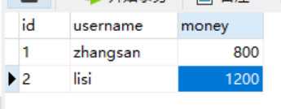


### 5.3.模拟事务操作场景

​	以上场景如果在张三向李四转账后程序出现了错误，导致张三扣了款而李四没有增加金额，这个时候就会出现不可逆的问题出现，我们将数据库双方金额都还原为1000元模拟这个场景测试，在UserService中做一个程序异常产生：

```java
// 转账的方法
    public void accountMoney() {
        // 张三转账少200
        userDao.reduceMoney();
        // 模拟异常出现
        int i = 10/0;
        // 李四收款多200
        userDao.addMoney();
    }
```

- **测试并查看数据库：**


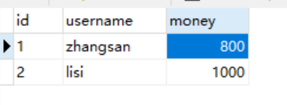

​	我们可以发现，因为程序在扣除张三的钱后出现了异常，导致张三金额少了200，李四的金额却没有增加，所以这种情况肯定不能在现实情况发生，那么我们该如何解决呢？这个时候我们就必须引入事务来进行处理，依据事务的原子性，要么都执行，要么都不执行，那么该如何配置事务呢？

​	这个时候我们需要先开启事务，查看程序在执行业务是否出现了异常，如果没有异常则可以提交这个事务，如果出现异常，则需要回滚事务操作-回到数据操作前的状态。


### 5.4.事务管理

​	Spring推荐将事务在Service层进行处理，而事务的管理有两种：编程式事务管理和声明式事务管理。编程式因为需要在每一个Service类中都要用代码来实现事务管理，所以会造成代码的臃肿，所以一般不使用这种方式管理事务，而推荐声明式事务管理。**声明式事务管理的底层原理是AOP的方式**。主要的事务管理器API接口如下：

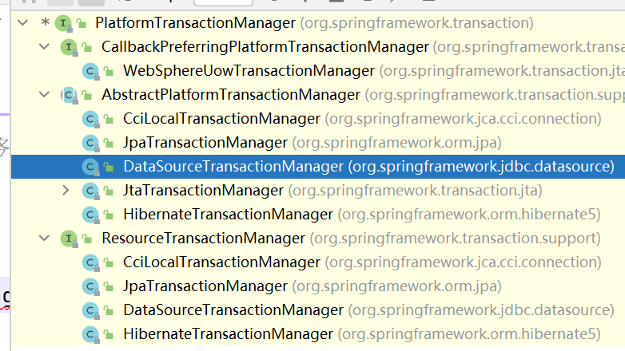

- **基于xml的方式：**

配置事务管理器和切入点：

```xml
<?xml version="1.0" encoding="UTF-8"?>
<beans xmlns="http://www.springframework.org/schema/beans"
       xmlns:context="http://www.springframework.org/schema/context"
       xmlns:tx="http://www.springframework.org/schema/tx"
       xmlns:aop="http://www.springframework.org/schema/aop"
       xmlns:xsi="http://www.w3.org/2001/XMLSchema-instance"
       xsi:schemaLocation="http://www.springframework.org/schema/beans http://www.springframework.org/schema/beans/spring-beans.xsd
        http://www.springframework.org/schema/context http://www.springframework.org/schema/context/spring-context.xsd
        http://www.springframework.org/schema/tx http://www.springframework.org/schema/tx/spring-tx.xsd
        http://www.springframework.org/schema/aop http://www.springframework.org/schema/aop/spring-aop.xsd">
    <!--开启事务注解-->
    <tx:annotation-driven transaction-manager="transactionManager"></tx:annotation-driven>
    <!--外部文件引入-->
    <context:property-placeholder location="classpath:com/sccs/spring/jdbc.propertise"></context:property-placeholder>
    <!--组件扫描-->
    <context:component-scan base-package="com.sccs.spring"></context:component-scan>
    <!--配置连接池-->
    <bean id="dataSource" class="com.alibaba.druid.pool.DruidDataSource"
                            destroy-method="close">
        <property name="driverClassName" value="${jdbc.driverClass}"></property>
        <property name="url" value="${jdbc.URL}"></property>
        <property name="username" value="${jdbc.username}"></property>
        <property name="password" value="${jdbc.password}"></property>
    </bean>
    <!--创建jdbcTemplate对象-->
    <bean id="jdbcTemplate" class="org.springframework.jdbc.core.JdbcTemplate">
        <!--注入dataSource-->
        <property name="dataSource" ref="dataSource"></property>
    </bean>

    <!--创建事务管理器-->
    <bean id="transactionManager" class="org.springframework.jdbc.datasource.DataSourceTransactionManager">
        <!--通过set注入数据源-->
        <property name="dataSource" ref="dataSource"></property>
    </bean>

    <!--配置增强通知-->
    <tx:advice id="tx_advice">
        <!--配置事务的相关参数-->
        <tx:attributes>
            <!--指定哪种规则的方法上添加事务-->
            <!--<tx:method name="accountMoney"/>-->
            <!--所有account开头的方法添加事务
            标签内部可以添加相关的参数和值-->
            <tx:method name="account*" propagation="REQUIRED"/>
        </tx:attributes>
    </tx:advice>

    <!--配置切入点和切面-->
    <aop:config>
        <!--切入点-->
        <aop:pointcut id="pt" expression="execution(* com.sccs.spring.service.UserService.*(..))"/>
        <!--切面-->
        <aop:advisor advice-ref="tx_advice" pointcut="pt"></aop:advisor>
    </aop:config>
</beans>
```


- **基于注解的方式：**

1.在配置文件spring_config.xml中配置事务管理器：

```xml
 <!--创建事务管理器-->
    <bean id="transactionManager" class="org.springframework.jdbc.datasource.DataSourceTransactionManager">
        <!--通过set注入数据源-->
        <property name="dataSource" ref="dataSource"></property>
    </bean>
```

2.在配置文件spring_config.xml中开启事务注解，**开启之前需要引入tx命名空间**：

```xml
<!--开启事务注解，transaction-manager的属性值为上面事务管理器的id-->
    <tx:annotation-driven transaction-manager="transactionManager"></tx:annotation-driven>
```

3.在Service层上加上注解@Transactional：

```java
/*
* @Transactional可以作用在类上，也可以作用在方法上
* 作用在类上表示所有方法都开启事务，作用在方法只是在该方法中实现事务*/
@Service
@Transactional
public class UserService {...}
```

4.测试并查看数据库：

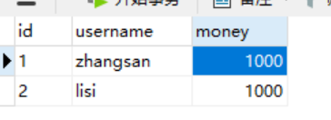

可以发现因为程序出现了异常，事务出现了回滚，使得金额并没有产生异常。


### 5.5.事务传参

@Transactional注解常用的参数有：

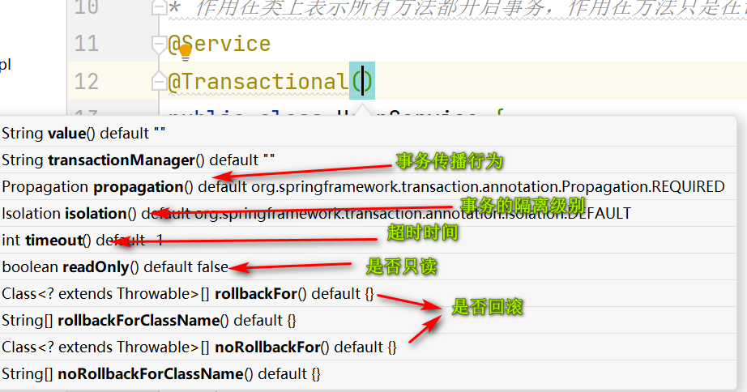

- **在Spring中事务的传播行为有7种：**

| 传播属性     | 描述                                                         |
| ------------ | ------------------------------------------------------------ |
| REQUIRED     | 如果有事务运行，当前的方法就在这个事务中运行，否则就启动一个新的事务，并在自己的事务里运行。 |
| REQUIRED_NEW | 当前的事务必须启动新的事务，并在自己的事务内运行，如果有事务在运行，应该将它挂起。 |
| SUPPORTS     | 如果事务在运行，当前的方法就在这个事务内运行，否则它可以不运行在事务中。 |
| NOT_SUPPORTS | 当前的方法不应该运行在事务中，如果有运行的事务，将它挂起。   |
| MANDATORY    | 当前的方法必须运行在事务内部，如果没有正在运行的事务，就抛出异常。 |
| NEVER        | 当前的方法不应该运行在食物中，如果有运行的事务，就抛出异常。 |
| NESTED       | 如果有事务在运行，当前的方法就应该在这个事务的嵌套事务内运行， 否则就启动一个新的事务，并在它自己的事务内运行。 |

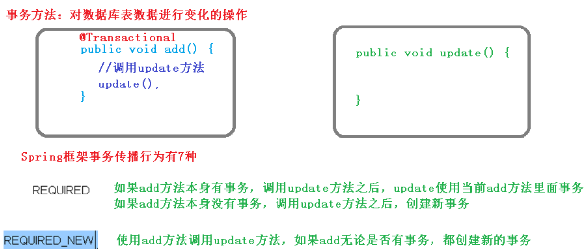


- **事务的隔离级别-为了在并发操作中（多事务）它们不会产生影响：**

| 事务隔离级别              | 脏读 | 不可重复度 | 幻读 |
| ------------------------- | ---- | ---------- | ---- |
| READ UNCOMMITED(读未提交) | 有   | 有         | 有   |
| READ COMMITED（读以提交） | 无   | 有         | 有   |
| REPEATABLE READ(可重复读) | 无   | 无         | 有   |
| SERIALIZABLE(串行化)      | 无   | 无         | 无   |

	- **脏读：**一个未提交的事务读取到了另一个未提交事务的数据；
	- **不可重复读：**一个未提交的事务读取到了另一提交事务修改的数据；
	- **幻读：**一个未提交的事务读取到了另一个提交事务添加数据。

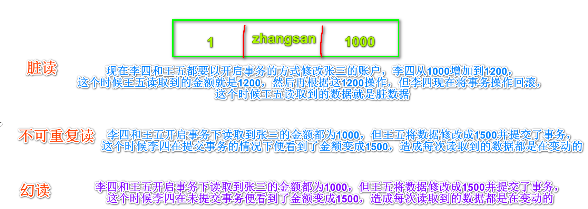

- **超时时间timeout:**设置在多长时间内提交事务，如果不提交事务就回滚事务，默认超时时间是-1，表示不超时，可以设置以秒为单位的超时时间。
- **是否只读readOnly:**读是查询操作，写是增删改。参数默认值是false，表示可以增删改查，设置成true后就只能查询，不能增删改了。
- **是否回滚rollback:**设置出现哪些**异常**进行回滚事务与否。


### 5.6.完全注解事务管理

1.创建配置文件，创建数据库连接，创建JdbcTemplate对象，创建事务管理器对象：

```java
package com.sccs.spring.config;

import com.alibaba.druid.pool.DruidDataSource;
import org.springframework.context.annotation.Bean;
import org.springframework.context.annotation.ComponentScan;
import org.springframework.context.annotation.Configuration;
import org.springframework.jdbc.core.JdbcTemplate;
import org.springframework.jdbc.datasource.DataSourceTransactionManager;
import org.springframework.transaction.annotation.EnableTransactionManagement;

import javax.sql.DataSource;

@Configuration
@ComponentScan(basePackages="com.sccs.spring")
@EnableTransactionManagement  // 开启事务
public class TX_config {

    // 创建数据库连接池
    @Bean
    public DruidDataSource getDruidDataSource() {
        DruidDataSource druidDataSource = new DruidDataSource();
        druidDataSource.setDriverClassName("com.mysql.jdbc.Driver");
        druidDataSource.setUrl("jdbc:mysql://localhost:3306/tb_user?userUnicode=true&characterEncoding=utf-8&useSSL=false");
        druidDataSource.setUsername("root");
        druidDataSource.setPassword("root");
        return druidDataSource;
    }

    // 创建JdbcTemplate
    @Bean
    public JdbcTemplate getJdbcTemplate(DataSource dataSource) {
        // 在IOC容器中根据类型找到dataSource
        JdbcTemplate jdbcTemplate = new JdbcTemplate();
        // 注入DataSource
        jdbcTemplate.setDataSource(dataSource);
        return jdbcTemplate;
    }

    // 创建事务管理器
    @Bean
    public DataSourceTransactionManager getTransactionManager(DataSource dataSource) {
        DataSourceTransactionManager transactionManager = new DataSourceTransactionManager();
        transactionManager.setDataSource(dataSource);
        return transactionManager;
    }
}

```

2.创建测试方法：

```java
@Test
    public void test02() {
        ApplicationContext context = new AnnotationConfigApplicationContext(TX_config.class);
        UserService userService = context.getBean("userService", UserService.class);
        userService.accountMoney();
    }
```

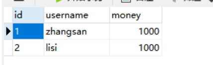


## 6.Spring5新功能


### 6.1.Spring整合日志框架

​	Spring自带了通用日志封装，但也可以整合Log4j，不过它移除了Log4jConfigListener接口，所以官方建议使用Log4j2的版本。

**1.引入相关jar包：**

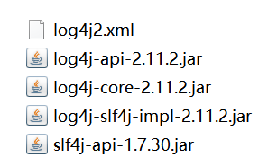

**2.创建log4j2.xml的文件进行配置：**

```xml
<?xml version="1.0" encoding="UTF-8"?>
<!--日志级别以及优先级排序: OFF > FATAL > ERROR > WARN > INFO > DEBUG > TRACE > ALL -->
<!--Configuration后面的status用于设置log4j2自身内部的信息输出，可以不设置，当设置成trace时，可以看到log4j2内部各种详细输出-->
<configuration status="INFO">
    <!--先定义所有的appender-->
    <appenders>
        <!--输出日志信息到控制台-->
        <console name="Console" target="SYSTEM_OUT">
            <!--控制日志输出的格式-->
            <PatternLayout pattern="%d{yyyy-MM-dd HH:mm:ss.SSS} [%t] %-5level %logger{36} - %msg%n"/>
        </console>
    </appenders>
    <!--然后定义logger，只有定义了logger并引入的appender，appender才会生效-->
    <!--root：用于指定项目的根日志，如果没有单独指定Logger，则会使用root作为默认的日志输出-->
    <loggers>
        <root level="info">
            <appender-ref ref="Console"/>
        </root>
    </loggers>
</configuration>
```

- **运行测试类就可以看到日志**

以上方式是自动日志的输出，但亦可以手动定义日志，输出想要的日志，创建类UserLog：

```java
package com.sccs.spring.test;

import org.slf4j.Logger;
import org.slf4j.LoggerFactory;

public class UserLog {

    public static final Logger log = LoggerFactory.getLogger(UserLog.class);

    public static void main(String[] args) {
        log.info("hello log4j2");
        log.debug("hello log4j");
    }
}
```

运行输出结果：

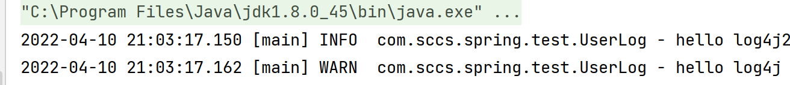


### 6.2.@Nullable注解和函数式编程

- @Nullable作用在方法上表示方法的返回值可以为空；
- @Nullable作用在方法的参数中时表示参数可以为空；
- @Nullable作用在属性上表示属性值可以为空。

Spring5支持函数式编程GenericApplicationContext/AnnotationConfigApplicationContext：

```java
package com.sccs.spring.test;

public class User {

    // 用new的方式需要配置才能注册到IOC容器中
   /* public static void main(String[] args) {
        User user = new User();
    }*/
    public void test() {
        System.out.println("User的test()方法执行了。。。");
    }
}

```

```java
@Test
    public void test04() {
        // 创建GenericApplicationContext对象
        GenericApplicationContext context = new GenericApplicationContext();
        // 通过context对象注册User的bean对象到容器中
        context.refresh();
        context.registerBean("user01",User.class, () -> new User());
        // 获取注册对象
        User user = (User)context.getBean("user01");
        user.test();
    }
```

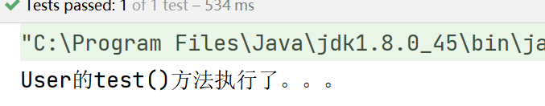


### 6.3.Spring5和JUnit5的整合

**整合JUnit4:**

**1.引入test的jar包：**


**2.在test包下创建JunitTest类测试：**

```java
package com.sccs.spring.test;

import com.sccs.spring.service.UserService;
import org.junit.Test;
import org.junit.runner.RunWith;
import org.springframework.beans.factory.annotation.Autowired;
import org.springframework.test.context.ContextConfiguration;
import org.springframework.test.context.junit4.SpringJUnit4ClassRunner;
/*
* @RunWith指定JUnit的版本
* @ContextConfiguration加载配置文件，相当于创建了ClassPathXmlApplicationContext对象*/
@RunWith(SpringJUnit4ClassRunner.class)
@ContextConfiguration("classpath:spring_config.xml")
public class JunitTest {

    // 注入对象
    @Autowired
    private UserService userService;

    @Test
    public void test01() {
        // 直接调用方法输出
        userService.accountMoney();
    }
}

```


**整合JUnit5:**

**1.引入Junit5的jar包：**


```java
package com.sccs.spring.test;

import com.sccs.spring.service.UserService;
import org.springframework.beans.factory.annotation.Autowired;
import org.springframework.test.context.ContextConfiguration;
import org.springframework.test.context.junit.jupiter.SpringExtension;

/*@ExtendWith(SpringExtension.class)
@ContextConfiguration("classpath:spring_config.xml")*/
@SpringJunitConfig(locations = "spring_config.xml")
public class JunitTest02 {

    // 注入对象
    @Autowired
    private UserService userService;

    @Test
    public void test01() {
        // 直接调用方法输出
        userService.accountMoney();
    }
}
```


### 6.4.WebFlux响应式编程

​	传统的web框架如Servlet对异步非阻塞的支持并不理想，而WebFlux是一个典型的非阻塞异步的框架，它支持Netty等，所以它的运行环境的选择性要比传统框架多。

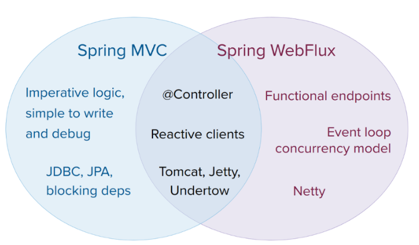

- **同步：**发送方发送请求后需要等到对方回应后才能再做处理；
- **异步：**发送请求后不需要等待响应，可以做其他事情；
- **阻塞：**被调用者收到请求后，做完了请求任务之后才反馈结果；
- **非阻塞：**收到请求后马上做出反馈然后再去做其他事情。

WebFlux的特点：

1. **非阻塞式：**在有限的资源下，提高系统吞吐量和伸缩率，以reactive为基础实现响应式编程；
2. **函数式编程：**基于Java8的基础上支持函数式编程方式实现路由请求。

**响应式编程：**是一种面向数据流和变化传播的编程范式。这意味着可以在编程语言中很方便地表达静态或动态的数据流，而相关的计算模型会自动将变化的值通过数据流进行传播。电子表格程序就是响应式编程的一个例子。单元格可以包含字面值或类似"=B1+C1"的公式，而包含公式的单元格的值会依据其他单元格的值的变化而变化。

#### 6.4.1.基于Java实现

​	在Java中提供了两个观察者模式的两个关键类：Observer 和 Observable。观察者就相当于部队的哨兵，观察周围数据的变化，然后发出通知。

1.创建Maven或Spring boot项目，并创建包创建类：

```java
package com.sccs.webflux_demo.reactor;

import java.util.Observable;

public class ObserverDemo extends Observable {

    public static void main(String[] args) {
        ObserverDemo observerDemo = new ObserverDemo();
        observerDemo.addObserver((o,arg) -> {
            System.out.println("这里发生了变化");
        });
        observerDemo.addObserver((o,arg) -> {
            System.out.println("注意观察，这里要变化了");
        });
        // 需要调用如下方法才能执行输出语句
        observerDemo.setChanged(); // 观察数据变化
        observerDemo.notifyObservers(); // 通知
    }
}
```

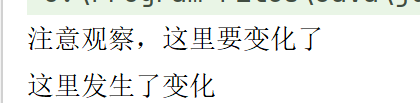


#### 6.4.2.基于reactor实现

​	在java9及之后版本基于类Flow实现。但也可以基于ractor框架实现。**Reactor** **是满足** **Reactive** **规范框架**。Reactor有两个核心类：Mono和Flux，这两个类的实现接口Publisher，提供了丰富的操作符，Flux对象实现发布者，返回N个元素；Mono实现发布者，返回0个或1个元素。

​	Flux和Mono都是数据流的发布者，使用它们都可以发送三种数据信号：元素值、错误信号、完成信号。错误信号和完成信号都代表终止信号，终止信号用于告诉订阅者数据流结束了，错误信号终止数据流的同时把错误信息传递给订阅者。

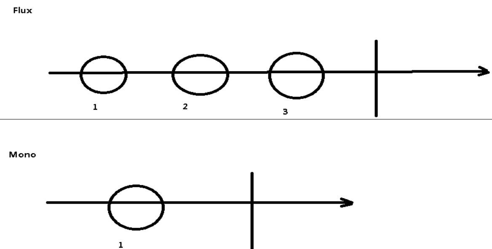

1.引入依赖：

```xml
<!-- https://mvnrepository.com/artifact/io.projectreactor/reactor-core -->
<dependency>
    <groupId>io.projectreactor</groupId>
    <artifactId>reactor-core</artifactId>
    <version>3.4.14</version>
</dependency>
```

2.编写代码测试：

```java
package com.sccs.webflux_demo.reactor;

import reactor.core.publisher.Flux;
import reactor.core.publisher.Mono;

import java.util.Arrays;
import java.util.List;
import java.util.stream.Stream;

public class TestReactor {

    public static void main(String[] args) {
        // just()方法可以直接声明元素，FLux可以声明多个元素，Mono只能声明一个
        Flux.just(1,2,3);
        Mono.just(1);

        // 以数组放元素
        Integer[] arrays = {1,2,3,4,};
        Flux.fromArray(arrays);

        // 以List方式
        List<Integer> list = Arrays.asList(arrays);
        Flux.fromIterable(list);

        // Stream流
        Stream<Integer> stream = list.stream();
        Flux.fromStream(stream);
    }
}
```

3.以上方法并不会输出任何内容，因为没有被订阅，调用just()或其他方法只是声明数据流，数据流并没有发出，只有进行订阅之后才能出发数据流，不订阅什么都不会发生：

```java
// just()方法可以直接声明元素，FLux可以声明多个元素，Mono只能声明一个
Flux.just(1,2,3).subscribe(System.out::println);
Mono.just(1).subscribe(System.out::println);
```


**三种信号的特点：**

1. 错误信号和完成信号都是终止信号，不能共存；
2. 如果没有发出任何元素值，而是直接发送了错误或者完成信号，表示空数据流；
3. 如果没有错误信号，没有完成信号，表示是无限数据流。

```java
// 错误信号
// Flux.error(new Exception());
```


#### 6.4.3.webflux执行流程和核心API

​	SpringWebFlux基于Reactor实现，默认使用的容器时Netty，它是一个高性能的NIO容器，异步非阻塞的框架。

- 阻塞BIO：

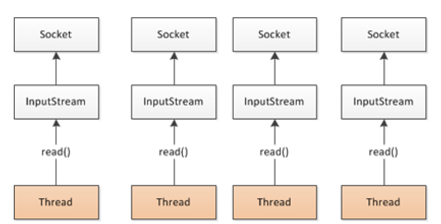

- 非阻塞NIO：

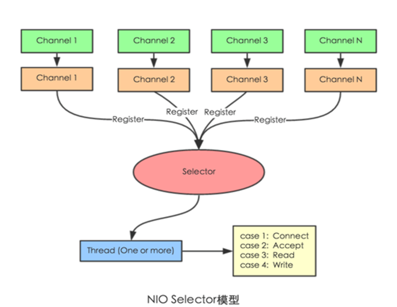

- **执行流程：**

核心控制器 DispatchHandler，实现接口 WebHandler，将starter的依赖改成webflux查看：

```xml
<dependency>
      <groupId>org.springframework.boot</groupId>
      <artifactId>spring-boot-starter-webflux</artifactId>
</dependency>
```

查看源码可以看到WebHandler的handle方法，打开这个方法的实现可以看到由类DispatcherHandler来进行实现：

```java
package org.springframework.web.server;

import reactor.core.publisher.Mono;

public interface WebHandler {
    Mono<Void> handle(ServerWebExchange var1);
}
```

```java
   public Mono<Void> handle(ServerWebExchange exchange) {
       // 方http请求响应信息，判断是否为空
        return this.handlerMappings == null ? this.createNotFoundError() : Flux.fromIterable(this.handlerMappings).concatMap((mapping) -> {
            // 根据请求地址获取对应mapping
            return mapping.getHandler(exchange);
        }).next().switchIfEmpty(this.createNotFoundError()).flatMap((handler) -> {
            // 调用具体业务方法
            return this.invokeHandler(exchange, handler);
        }).flatMap((result) -> {
            // 处理结果返回
            return this.handleResult(exchange, result);
        });
    }
/*
DispatcherHandler负责请求处理，其中：
HandlerMapping：请求查询到处理的方法
HandlerAdapter：真正负责请求处理
HandlerResultHandler：响应结果处理
*/
```

SpringWebflux 实现函数式编程，两个接口：RouterFunction（路由处理）和 HandlerFunction（处理函数）。


#### 6.4.4.webflux的实现

- **基于注解的模式，SpringBoot会默认启动Netty作为服务器来运行**：

1.创建spring boot工程，将起步依赖改为webflux的依赖：

```xml
<dependency>
      <groupId>org.springframework.boot</groupId>
      <artifactId>spring-boot-starter-webflux</artifactId>
</dependency>
```

2.在propertise文件中修改端口号：

```propertise
# 应用名称
spring.application.name=webflux_demo01
# 端口号
server.port=8888
```

3.创建entity、controller、service的包并相关的接口：

```java
package com.sccs.webflux_demo01.entity;

import lombok.Data;

@Data
public class User {

    private String name;
    private String gender;
    private Integer age;
    public User() {
    }
    public User(String name, String gender, Integer age) {
        this.name = name;
        this.gender = gender;
        this.age = age;
    }
}
```

```java
package com.sccs.webflux_demo01.service;

import com.sccs.webflux_demo01.entity.User;
import reactor.core.publisher.Flux;
import reactor.core.publisher.Mono;

public interface UserService {
    //根据 id 查询用户
    Mono<User> getUserById(int id);
    //查询所有用户
    Flux<User> getAllUser();
    //添加用户
    Mono<Void> saveUserInfo(Mono<User> user);
}
```

```java
package com.sccs.webflux_demo01.service;

import com.sccs.webflux_demo01.entity.User;
import reactor.core.publisher.Flux;
import reactor.core.publisher.Mono;

import java.util.HashMap;
import java.util.Map;
@Service
public class UserServiceImpl implements UserService{
    // 构造map
    private final Map<Integer,User> users = new HashMap<>();
    public UserServiceImpl() {
        this.users.put(1,new User("micheal","boy",18));
        this.users.put(2,new User("james","boy",25));
        this.users.put(3,new User("lucy","girl",17));
    }
    @Override
    public Mono<User> getUserById(int id) {
        // 根据id获取
        return Mono.justOrEmpty( this.users.get(id));
    }

    @Override
    public Flux<User> getAllUser() {
        return Flux.fromIterable(this.users.values());
    }

    @Override
    public Mono<Void> saveUserInfo(Mono<User> userMono) {
        return userMono.doOnNext(person -> {
            // 向map里面放值,因为不能重复，所以+1
            int id =users.size()+1;
            users.put(id,person);
        }).thenEmpty(Mono.empty()); // 数据流结束
    }
}
```

```java
@RestController
public class UserController {
    //注入 service
    @Autowired
    private UserService userService;
    //id 查询
    @GetMapping("/user/{id}")
    public Mono<User> geetUserId(@PathVariable int id) {
        return userService.getUserById(id);
    }
    //查询所有
    @GetMapping("/user")
    public Flux<User> getUsers() {
        return userService.getAllUser();
    }
    //添加
    @PostMapping("/saveuser")
    public Mono<Void> saveUser(@RequestBody User user) {
        Mono<User> userMono = Mono.just(user);
        return userService.saveUserInfo(userMono);
    } 
}
```

4.启动访问http://localhost:8888/user测试：

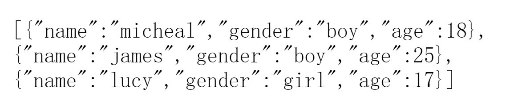


- **基于函数式编程**

在使用函数式编程需要初始化自己的服务器，由两个核心的接口组成：RouterFunction(实现路由功能，将请求转发给对应的Handler)和HandlerFunction(处理请求生成响应函数)。核心任务式定义两个函数式接口的实现并启动服务器。

SpringWebflux 请 求 和 响 应 不 再 是 ServletRequest 和 ServletResponse ，而是ServerRequest 和ServerResponse。

1.将注解实现的工程复制为webflux-demo02，删除controller的实现，保留entity和service部分;

2.创建handler包，并创建UserHandler：

```java
package com.sccs.webflux_demo01.handler;

import com.sccs.webflux_demo01.entity.User;
import com.sccs.webflux_demo01.service.UserService;
import org.springframework.http.MediaType;
import org.springframework.web.reactive.function.server.ServerRequest;
import org.springframework.web.reactive.function.server.ServerResponse;
import reactor.core.publisher.Flux;
import reactor.core.publisher.Mono;

import static org.springframework.web.reactive.function.BodyInserters.fromObject;

public class UserHandler {
    private final UserService userService;
    public UserHandler(UserService userService) {
        this.userService = userService;
    }
    //根据 id 查询
    public Mono<ServerResponse> getUserById(ServerRequest request) {
        //获取 id 值
        int userId = Integer.valueOf(request.pathVariable("id"));
        //空值处理
        Mono<ServerResponse> notFound = ServerResponse.notFound().build();
        //调用 service 方法得到数据
        Mono<User> userMono = this.userService.getUserById(userId);
        //把 userMono 进行转换返回
        //使用 Reactor 操作符 flatMap
        return userMono.flatMap(person -> ServerResponse.ok().contentType(MediaType.APPLICATION_JSON)
                                        .body(fromObject(person)))
                        .switchIfEmpty(notFound);
    }
    //查询所有
    public Mono<ServerResponse> getAllUsers(ServerRequest request) {
        //调用 service 得到结果
        Flux<User> users = this.userService.getAllUser();
        return
                ServerResponse.ok().contentType(MediaType.APPLICATION_JSON).body(users,User.class);
    }
    //添加
    public Mono<ServerResponse> saveUser(ServerRequest request) {
        //得到 user 对象
        Mono<User> userMono = request.bodyToMono(User.class);
        return
                ServerResponse.ok().build(this.userService.saveUserInfo(userMono));
    }
}
```

3.初始化服务器，创建Route路由，在总包结构下创建Server:

```java
package com.sccs.webflux_demo01;

import com.sccs.webflux_demo01.handler.UserHandler;
import com.sccs.webflux_demo01.service.UserService;
import com.sccs.webflux_demo01.service.UserServiceImpl;
import org.springframework.http.server.reactive.HttpHandler;
import org.springframework.http.server.reactive.ReactorHttpHandlerAdapter;
import org.springframework.web.reactive.function.server.RouterFunction;
import org.springframework.web.reactive.function.server.RouterFunctions;
import org.springframework.web.reactive.function.server.ServerResponse;
import reactor.netty.http.server.HttpServer;

import static org.springframework.http.MediaType.APPLICATION_JSON;
import static org.springframework.web.reactive.function.server.RequestPredicates.GET;
import static org.springframework.web.reactive.function.server.RequestPredicates.accept;
import static org.springframework.web.reactive.function.server.RouterFunctions.toHttpHandler;

public class Server {

    //1 创建 Router 路由
    public RouterFunction<ServerResponse> routingFunction() {
        //创建 hanler 对象
        UserService userService = new UserServiceImpl();
        UserHandler handler = new UserHandler(userService);
        //设置路由
        return RouterFunctions.route(
                GET("/users/{id}").and(accept(APPLICATION_JSON)),handler::getUserById)
                .andRoute(GET("/users").and(accept(APPLICATION_JSON)),handler::getAllUsers);
    }

    //2 创建服务器完成适配
    public void createReactorServer() {
        //路由和 handler 适配
        RouterFunction<ServerResponse> route = routingFunction();
        HttpHandler httpHandler = toHttpHandler(route);
        ReactorHttpHandlerAdapter adapter = new
                ReactorHttpHandlerAdapter(httpHandler);
        //创建服务器
        HttpServer httpServer = HttpServer.create();
        httpServer.handle(adapter).bindNow();
    }

    // 最终启动调用
    public static void main(String[] args) throws Exception{
        Server server = new Server();
        server.createReactorServer();
        System.out.println("enter to exit");
        System.in.read();
    }
}
```

4.根据控制台的端口访问localhost:port/users

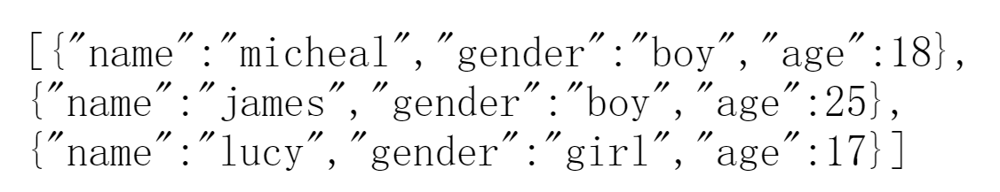

- 使用WebClient实现，在总包结构下创建Client类：

```java
package com.sccs.webflux_demo01;

import com.sccs.webflux_demo01.entity.User;
import org.springframework.http.MediaType;
import org.springframework.web.reactive.function.client.WebClient;
import reactor.core.publisher.Flux;

public class Client {
    public static void main(String[] args) {
        //调用服务器地址
        WebClient webClient = WebClient.create("http://127.0.0.1:端口号");
        //根据 id 查询
        String id = "1";
        User userresult = webClient.get().uri("/users/{id}", id)
                .accept(MediaType.APPLICATION_JSON).retrieve().bodyToMono(User.class)
                .block();
        System.out.println(userresult.getName());
        //查询所有
        Flux<User> results = webClient.get().uri("/users")
                .accept(MediaType.APPLICATION_JSON).retrieve().bodyToFlux(User
                        .class);
        results.map(stu -> stu.getName())
                .buffer().doOnNext(System.out::println).blockFirst();
    }
}
```

启动测试观察控制台输出：

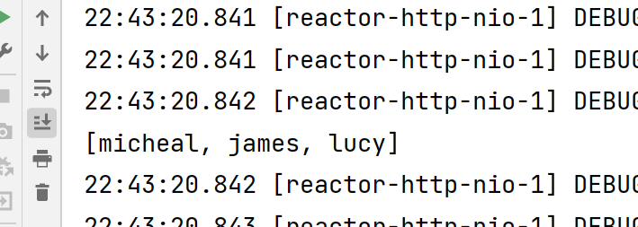