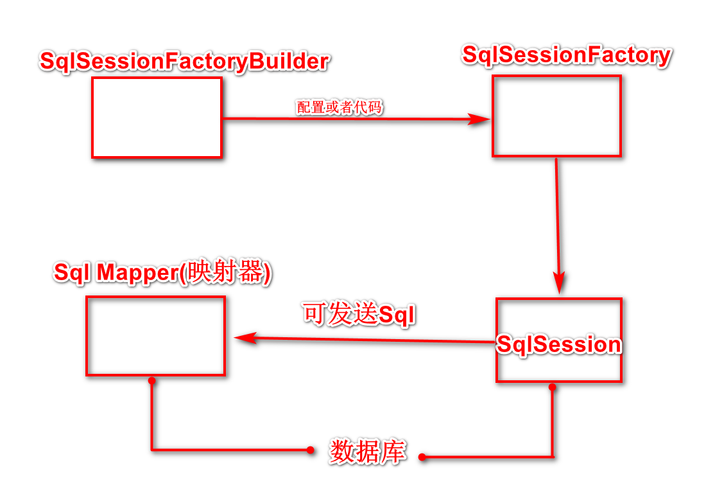
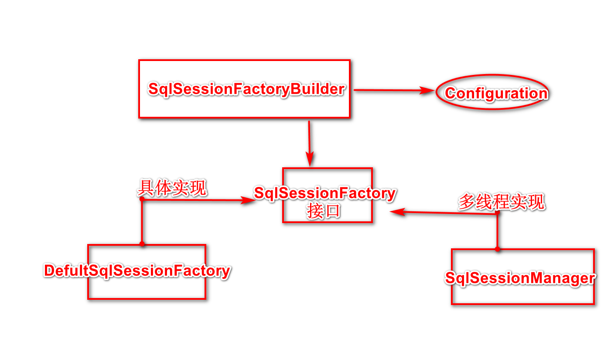

# 第一章.SSM-Spring,SpringMVC,MyBatis

## 1.三层架构


### 1.1.三层架包含三层：

​	界面层(User Interface Layer)，业务逻辑层(Business Logic Layer)，数据访问层(Data Access Layer)。


### 1.2.三层的职责：

- 界面层（表示层，视图层）：主要功能是接收客户的数据，显示请求的处理结果。使用web页面和用户交互。
- 业务逻辑层：接收表示层传递过来的数据，检查数据，计算业务逻辑，调用数据访问层获取数据。
- 数据访问层：与数据路打交道，主要实现对数据的增删改查，将存储在数据可中的数据提交给业务层，同时将业务层处理的数据保存到数据库中。


# 第二章.数据持久层--MyBatis

## 1.持久层的概念

​	持久层可以将业务数据存储到磁盘中，具备长期存储的能力，只要磁盘不损坏，在断电或其他情况下，重新启动系统仍然可以读取这些数据。

**现在，中国互联网大都应用MyBatis作为持久层框架来访问数据库。**

## 2.MyBatis的主要功能

- 不屏蔽SQL，意味着可以更精准的定位SQL语句，可以对其优化和改造，这有利于互联网系统性能的提高，符合互联网需要性能优化的特点。
- 提供强大，灵活的映射机制，方便Java开发者使用。
- 提供了Mapper的接口编程，只要一个接口和一个XML就能创建映射器，这样开发者就能更集中于业务逻辑。

## 3.MyBatis的环境

​	MyBatis所需要的包和源码可以通过https://github.com/mybatis/mybatis-3/releases进行下载。还可以通过MyBatis的官网阅读相关的参考手册http://www.mybatis.org/mybatis-3/zh/getting-started.html。

## 4.MyBatis的核心组件

### 4.1.MyBatis的核心组件分为4个部分：

- SqlSessionFactoryBuilder(构造器):它会根据配置或者代码来生成SqlSessionFactory，采用的是分部构建的Builder模式。
- SqlSessionFactory(工厂接口):依靠它来生成SqlSession,使用的是工厂模式。
- SqlSession(会话)：一个既能发送SQL执行返回结果，也可以获取Mapper的接口。在现有的技术中，一般我们会让其在业务逻辑代码中“消失”，而使用的是MyBatis提供的SQL Mapper接口编程技术，它能提高代码的可读性和可维护性。
- SQL Mapper(映射器)：由一个Java接口和XML文件(或注解)构成，需要给出对应的SQL和映射规则，它负责发送SQL去执行，并返回结果。



### 4.2.SqlSessionFactoryBuilder(工厂接口)

​	使用MyBatis首先是使用配置或者代码去生产SqlSessionFactory，而MyBatis提供了构造器SqlSessionFactoryBuilder。它提供了一个类org.apache.ibatis.session.Configuration作为引导，采用的是Builder模式。

​	在MyBatis中，既可以通过读取配置的XML文件的形式生成SqlSessionFactory，也可以通过Java代码的形式生成。



​	每个基于MyBatis的应用都是以一个SqlSessionFactory的实例为中心的，而SqlSessionFactory唯一的作用就是生产MyBatis的核心接口对象SqlSession，所以它的责任是唯一的。我们往往采用单例模式处理它。我们可以使用配置文件和Java代码两种形式去生成SqlSessionFactory。

#### 4.2.1.使用XML构建SqlSessionFactory（推荐用法）

​	**使用XML配置，并命名为mybatis-config.xml.**

```
<?xml version="1.0" encoding="UTF-8" ?>
	<!DOCTYPE configuration
	PUBLIC "-//mybatis.org//DTD Config 3.0//EN"
	"http://mybatis.org/dtd/mybatis-3-config.dtd">
	<configuration>
		<typeAliases>
			<typeAliase alias="role" type="com.learn.ssm.chapter3.pojo.Role"/>
		</typeAliases>
        <environments default="development">
        <environment id="development">
        <transactionManager type="JDBC"/>
        <dataSource type="POOLED">
        <property name="driver" value="${driver}"/>
        <property name="url" value="${url}"/>
        <property name="username" value="${username}"/>
        <property name="password" value="${password}"/>
        </dataSource>
        </environment>
        </environments>
        <mappers>
            <mapper resource="org/mybatis/example/BlogMapper.xml"/>
        </mappers>
	</configuration>
```

- <typeAliases>元素定义一个别名name，它代表着com.learn.ssm.chapter3.pojo.Name这个类。这样定义后，在MyBatis上下文中就可以使用别名去代替它的全限定名了。
- <environment>元素的定义，这里描述的是数据库，它里面的<transactionManager>元素是配置事务管理器，这里采用的是MyBatis的JDBC管理器方式。然后采用<dataSource>元素配置数据库，其中type="POOLED"代表采用MyBatis内部提供的连接池方式，最后定义一些关于JDBC的属性信息。
- <mapper>元素代表引入的哪些映射器。

**有了以上基础，就可以用简短的代码来生成SqlSessionFactory了。**

```
SqlSessionFactory sqlSessionFactory = null;
String resource = "mybatis-config.xml";
InputStream inputStream;
try {
	inputStream = Resource.getResourceAsStream(resouce);
	sqlSessionFactory = new SqlSessionFactoryBuilder().build(inputStream);
} catch(IOException e) {
		e.printStackTrace();
}
```

​	**首先读取mybatis-config.xml，然后通过SqlSessionFactoryBuilder()的Build方法去创建SqlSessionFactory.**

​	采用XML创建的形式，信息在配置文件中，有利于我们日后的维护和修改，避免了重新编译代码。

#### 4.2.2.使用代码创建SqlSessionFactory

```
// 数据库连接池信息
PooledDataSource dataSource = new PooledDataSource();
dataSource.setDriver("com.mysql.jdbc.Driver");
dataSource.setUsername("root");
dataSource.setPassword ("123456");
dataSource.setUrl("jdbc:mysql://localhost:3306/ssm");
dataSource.setDefeultAutoCommit(false);
// 采用 MyBatis 的 JDBC 事务方式
TransactionFactory transactionFactory = new JdbcTransactionFactory();
Environment environment = new Environment ("development", transactionFactory, dataSource);
// 创建 Configuration 对象
Configuration configuration = new Configuration(environment);
// 注册一个 MyBatis 上下文别名
configuration.getTypeAliasRegistry().registerAlias("role", Role.class);
// 加入一个映射器
configuration.addMapper(Role.class);
//使用 SqlSessionFactoryBuilder 构建 SqlSessionFactory
SqlSessionFactory SqlSessionFactory = new SqlSessionFactoryBuilder().build(configuration);
return SqlSessionFactory;
```

​	这种方式代码冗长，如果发生系统修改，那么有可能需要重新编译代码才能继续，所以这不是一个很好的方式。

### 4.3.SqlSession

​	在MyBatis中，SqlSession是其核心接口。在MyBatis中由两个实现类，DefaultSqlSession和SqlSessionManager,DefaultSqlSession是单线程使用的，而SqlSessionManager是在多线程环境下使用的。SqlSession的具体作用有3个：

- 获取Mapper接口；
- 发送Sql给数据库；
- 控制数据库事务。

有了SqlSessionFactory，创建SqlSession就十分简单了：

```
SqlSession sqlSession = SqlSessionFactory.openSession();
```

​	SqlSession控制数据可事务的方法：

```
// 定义SqlSession
SqlSession sqlSession = null;
try {
	// 打开SqlSession会话
	sqlSession = SqlSessionFactory.openSession();
	// some code...
	sqlSession.commit();// 提交事务
} catch(Exception e) {
	sqlSession.rollback();// 回滚事务
} finally {
	// 在finally语句中确保资源被顺利关闭
	if (sqlSession != null) {
	sqlSession.close();
	}
}
```

​	这里使用commit方法提交事务，或者使用rallback方法回滚事务。因为它代表着一个数据库连接资源，使用后要及时关闭，如果不关闭，那么数据库的连接资源就会很快被耗费光，整个系统就会陷入瘫痪状态，所以finally语句保证其顺利关闭。

### 4.4.映射器

​	映射器是MyBatis中最重要，最复杂的组件，它由一个接口和对应的XML文件（或注解）组成，它可以配置以下内容：

- 描述映射规则而；
- 提供sql语句，并可以配置sql参数类型，返回类型，缓存刷新等信息；
- 配置缓存；
- 提供动态sql。

**映射器主要是将SQL查询到的结果映射为一个POJO，或者将POJO的数据插入到数据库中，并定义一些关于缓存等的重要内容。**所以我们先定义一个POJO类。

```
public class Role {
	private Long id;
	private String roleName;
	private String note;
	/*setter and getter*/
}
```

实现映射器的方式有XML和注解两种方式。

#### 4.4.1.用XML实现映射器

​	用XML实现映射器分为两个部分：接口和XML。先定义一个映射器接口：

```
public interface RoleMapper {
	public Role getRole(Long id);
}
```

​	再用XML的方式创建SqlSession的配置文件中添加如下代码：

```
<mapper resource="com/learn/ssm/mapper/RoleMapper.xml"/>
```

​	它的作用是引入一个XML文件。用XML创建映射器需要如下代码：

```
<?xml version="1.0" encoding="UTF-8" ?>
<!DOCTYPE mapper PUBLIC "-//mybatis.org//DTD Mapper 3.0//EN" "http://mybatis.org/dtd/mybatis-3-mapper.dtd">
<mapper namespace="com.learn.ssm.mapper.RoleMapper">
	<select id="getRole" parameterType="long" resultType="role">
	select id,role_name as roleName,note from t_role where id = #{id}
	</select>
</mapper>
```

​	有了这两个文件，就完成了映射器的定义。XML文件还算简单，我们稍微了解下：

- <mapper>元素中的namespace所对应的是一个接口的全限定名，于是MyBatis上下文就可以通过它找到对应的接口；

- <select>元素表明这是一条查询语句，而属性id表示了这条SQL，属性parameterType="long"说明传递给SQL的是一个long类型的参数，而resultType="role"表明返回值为role,而role就是之前配置文件mybatis-config.xml配置的别名，指代的是POJO中的Role类；

- 这条SQL中的#{id}表示传递过去的参数。

#### 4.4.2.注解实现映射器

```
public interface RoleMapper {
	
	@Select("select id,role_name as roleName,note from t_role where id = #{id}")
	public Role getRole(Long id);
}
```

## 5.生命周期

